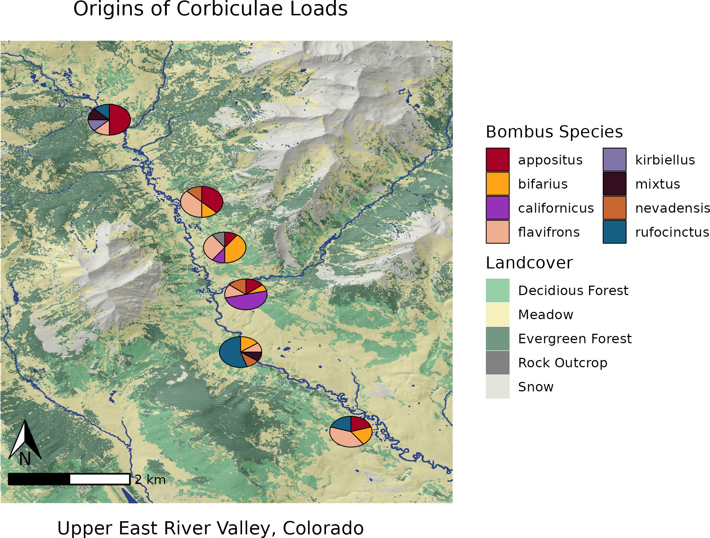

```{r, include=FALSE}
knitr::opts_chunk$set(echo = F, warning = F, message = F)
```

```{r Create Table 1}
variable <- c(
  rep('Climate', times = 4),
  rep('Elevation', times = 4), 
  rep('Land Uses / Land Covers', times = 4), 
  rep('Vegetation Cover', times = 1), 
  rep('Soils & Geomorphology', times = 4)
)

dataSrc <- c(
  'WorldClim', 
  'CHELSA',
  'Gridded Surface Meterological (GRIDMET)',
  'PRISM', 
             
  'Multi-Error-Removed Improved-Terrain DEM', 
  'Global Multi-resolution Terrain Elevation Data (GMTED2010)',
  'Aster Global Digital Elevation Model (ASTCTM)', 
  'United States National Elevation Dataset', 
             
  'Dynamic World', 
  'Global Land Cover Characterization (GLCC)', 
  'Moderate Resolution Imaging Spectroradiometer (MODIS) Land Cover', 
  'National Land Cover Dataset (NLCD)',
             
  'Remote Sensing Products (e.g. Landsat, MODIS)',
             
  'SoilGrids', 
  'Harmonized World Soil Database', 
  'GeoMorpho90m',
  'Web Soil Survey'
)
             
coverage <- c(
  rep('Global', times = 2),
  rep('CONUS', times = 2),
  
  rep('Global', times = 3),
  'CONUS', 
  
  rep('Global', times = 3), 
  'CONUS', 
  
  'Global', 
  
  rep('Global', times = 3), 
  'CONUS'
)  
             

df <- data.frame(variable, dataSrc, coverage)

info <- 'Example of environmental variables and data sources commonly used in species distribution models that could be used during the spatial filtering step of our approach.'
```

```{r}
knitr::kable(
  df, 
  caption = info, 
  col.names = c('Variable', 'Data Source', 'Geographic Extent'),
  booktabs = TRUE, 
  format  = "latex",
  longtable = FALSE
  ) |> 
  kableExtra::row_spec(0,bold=TRUE) |>
  kableExtra::collapse_rows(1) |>
  kableExtra::kable_styling(latex_options="scale_down") |>
  kableExtra::add_footnote('CONUS; CONtinental United States') |>
  kableExtra::kable_styling(latex_options = "HOLD_position")

```

\newpage 

Figure 1 - Site Info

```{r Site Maps, echo = F, out.width="90%"}

```

\newpage 

Table 2 - Models used for Species Distribution Model Ensembles

The two machine learning models utilize Ensemble learning.

__Ensemble learning__ utilizes many sets of trees, each tree being composed of many binary decisions, to create a single model. Each independent variable ( - or *feature*) may become a node on the tree - i.e. a location on the tree where a binary decision will move towards a predicted outcome. Each of the decision tree models which ensemble learning utilizes is a weak model, each of which may suffer due to high variance or bias, but which produce better outcomes than would be expected via chance. When ensembled these models generate a strong model, a model which should have more appropriately balanced variance and bias and predicts outcomes which are more strongly correlated with the expected values than the individual weak models. 

*__Random Forest (RF)__* the training data are continually bootstrap re-sampled, in combination with random subsets of features, to create nodes which attempt to optimally predict a known outcome. A large number of trees are then aggregated, via the most common predictions, to generate a final classification prediction tree. Each individual prediction tree is generated independently of the others. 

*__Boosted Regression Tree (BRT)__* (or Gradient Boosted tree) An initial tree is grown, and all other trees are derived sequentially from it, as each new tree is grown the errors in responses from the last tree are weighed more heavily so that the model focuses on selecting dependent variables which refine predictions. All response data and predictor variables are kept available to all trees.

*__Bias__* predictions from an algorithm are systematically in error due to being prejudiced for or against certain results, due to assumptions during learning.

*__Variance__* errors in models due to an over-reliance and sensitivity of training to outliers in training data. 

In general, Random Forest  models have high bias and low variance, where boosted regressions trees have lower bias and higher variance. Theoretically, the weaknesses and strengths of bootstrap aggregation (bagging) as implemented by Random Forests are supplemented by the boosting. 


\newpage

Table 3 - Species Distribution Models Predictors

Layer   LM                     Description                              Name                    Source
----   ----      ------------------------------------------    -------------------------     ----------------
1.      N              Mean annual cloudiness - MODIS           Cloud Cover (EarthEnv)       Wilson et al. 2016
2.      Y            Cloudiness seasonality 1 - MODIS           Cloud Cover (EarthEnv)       Wilson et al. 2016 
3.      N            Cloudiness seasonality 2 - MODIS           Cloud Cover (EarthEnv)       Wilson et al. 2016 
4.      Y            Cloudiness seasonality 3 - MODIS           Cloud Cover (EarthEnv)       Wilson et al. 2016
5.      N           Beginning of the frost-free period                 ClimateNA               Wang et al. 2016
6.      N              Climatic moisture deficit                       ClimateNA               Wang et al. 2016
7.      N               Degree-days above 5C                           ClimateNA               Wang et al. 2016
8.      N              Mean annual precipitation                       ClimateNA               Wang et al. 2016
9.      Y           Mean annual precipitation as snow                  ClimateNA               Wang et al. 2016
10.     Y               Temperature seasonality                        ClimateNA               Wang et al. 2016
11.     Y         2015 Percent Grass/Herbaceous cover - MODIS           (MOD44B)
12.     Y          2015 Percent Tree cover from Landsat 7/8              (GLCC)
13.     Y         Soil probability of bedrock (R Horizon)               SoilGrids              Hengl et al. 2017
14.     N           Soil organic carbon (Tonnes / ha)                   SoilGrids              Hengl et al. 2017
15.     N                Surface soil pH in H~2~O                       SoilGrids              Hengl et al. 2017
16.     Y               Surface soil percent sand                       SoilGrids              Hengl et al. 2017
17.     Y                     Soil USDA class                           SoilGrids              Hengl et al. 2017
18.     N                   Topographic elevation               Topography (EarthEnv)         Amatulli et al. 2018   
19.     Y           Topographic elevation, moving window.       Topography (EarthEnv)         Amatulli et al. 2018   
20.     Y               Topographic percent slope               Topography (EarthEnv)         Amatulli et al. 2018    
21.     Y               Topographic wetness index               Topography (EarthEnv)         Amatulli et al. 2018    
22.     Y                  Topographic aspect                   Topography (EarthEnv)         Amatulli et al. 2018   
23.     Y         Annual potential solar radiation computed               r.sun
24.     N        Estimated actual (w/-cloud) solar radiation              r.sun                Wilson et al. 2016
25.     Y        Log-transformed distance to surface water      Global Surface Water Explorer   Pekel et al. 2016
26.     Y                Percent surface water                  Global Surface Water Explorer   Pekel et al. 2016
----   ----     -------------------------------------------    ------------------------------   ----------------

Amatulli, G., Domisch, S., Tuanmu, M.-N., Parmentier, B., Ranipeta, A., Malczyk, J., and Jetz, W. (2018) A suite of global, cross-scale topographic variables for environmental and biodiversity modeling. Scientific Data volume 5, Article number: 180040. DOI: doi:10.1038/sdata.2018.40.

Hengl T, Mendes de Jesus J, Heuvelink GBM, Ruiperez Gonzalez M, Kilibarda M, Blagotić A, et al. (2017) SoilGrids250m: Global gridded soil information based on machine learning. PLoS ONE 12(2): e0169748. https://doi.org/10.1371/journal.pone.0169748

Pekel, JF., Cottam, A., Gorelick, N. et al. High-resolution mapping of global surface water and its long-term changes. Nature 540, 418–422 (2016). https://doi.org/10.1038/nature20584

Wang T, Hamann A, Spittlehouse D, Carroll C (2016) Locally Downscaled and Spatially Customizable Climate Data for Historical and Future Periods for North America. PLoS ONE 11(6): e0156720. https://doi.org/10.1371/journal.pone.0156720

Wilson AM, Jetz W (2016) Remotely Sensed High-Resolution Global Cloud Dynamics for Predicting Ecosystem and Biodiversity Distributions. PLoS Biol 14(3): e1002415. https://doi.org/10.1371/journal.pbio.1002415

\newpage

Table 4 - Molecular Reference Specimen Table

```{r Voucher Reference Specimen table 1, echo = F, out.height="90%"}

```

\newpage
Figure 2 - Pollen Key

```{r Pollen Key 1, echo = F}
knitr::include_graphics('../graphics/assorted/RMBL_pollen_key-1.pdf')
```

\newpage

```{r Pollen Key 2, echo = F}
knitr::include_graphics('../graphics/assorted/RMBL_pollen_key-2.pdf')
```


\newpage

Table 5 - All Species in the Sequence Databases 

```{r Seq DB 1, echo = F}
knitr::include_graphics('../graphics/assorted/kraken_db_spp_table-1.pdf')
```

\newpage

```{r Seq DB 2, echo = F}
knitr::include_graphics('../graphics/assorted/kraken_db_spp_table-2.pdf')
```

\newpage

```{r Seq DB 3, echo = F}
knitr::include_graphics('../graphics/assorted/kraken_db_spp_table-3.pdf')
```

\newpage

```{r Seq DB 4, echo = F}
knitr::include_graphics('../graphics/assorted/kraken_db_spp_table-4.pdf')
```

\newpage

Figure 3 - Reads Per Loci

```{r READS PER LOCI - REFERENCE, echo = F, out.width = '98%'}
knitr::include_graphics('../graphics/plots/Loci_Reference_Samples.png')
```

\newpage 

Figure 4 - Percent Loci Matched by Sample 
```{r READS PER LOCI - METAGENOMICS, echo = F, out.width = '98%'}
knitr::include_graphics('../graphics/plots/Percent_loci_matched_by_sample.png')
```

\newpage 

Figure 5 - Comparison of Kraken2, Bracken, and BLAST

```{r Molecular Networks, echo = F, out.width="110%"}
knitr::include_graphics('../graphics/plots/Molecular_nets-crop.pdf')
```

\newpage

Figure 6 - Microscopy Rarefaction, Abundance

```{r, echo = F, out.width="90%"}
knitr::include_graphics('../graphics/plots/SppAbundance.png')
```

\newpage 

Figure 7 - Microscopy Rarefaction, Richness

```{r, echo = F, out.width="90%"}
knitr::include_graphics('../graphics/plots/species_richness_rarefaction.png')
```

\newpage 

Table 6 - Binary Reclassification Process

```{r, echo = F, out.width="90%"}
knitr::include_graphics('../graphics/tables/reclassify_reads_table.pdf')
```

