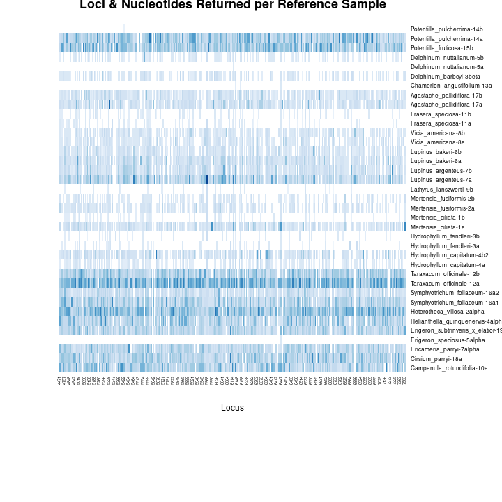

# Sp 

\newpage

Appendix 1 - Site Maps

```{r Site Maps, echo = F}
knitr::include_graphics('../graphics/plots/siteMaps.png')
```

\newpage

Appendix 2 - Species Distribution Models Predictors

Layer   LM                     Description                              Source
----   ----      ------------------------------------------    -------------------------
1.      N              Mean annual cloudiness - MODIS              Wilson et al. 2016
2.      Y            Cloudiness seasonality 1 - MODIS              Wilson et al. 2016 
3.      N            Cloudiness seasonality 2 - MODIS              Wilson et al. 2016 
4.      Y            Cloudiness seasonality 3 - MODIS              Wilson et al. 2016
5.      N           Beginning of the frost-free period                 Wang et al.
6.      N              Climatic moisture deficit                       Wang et al.
7.      N               Degree-days above 5C                           Wang et al.
8.      N              Mean annual precipitation                       Wang et al.
9.      Y           Mean annual precipitation as snow                  Wang et al.
10.     Y               Temperature seasonality                        Wang et al.
11.     Y         2015 Percent Grass/Herbaceous cover - MODIS           (MOD44B)
12.     Y          2015 Percent Tree cover from Landsat 7/8              (GLCF)
13.     Y         Soil probability of bedrock (R Horizon)               SoilGrids
14.     N           Soil organic carbon (Tonnes / ha)                   SoilGrids
15.     N                Surface soil pH in H~2~O                       SoilGrids
16.     Y               Surface soil percent sand                       SoilGrids
17.     Y                     Soil USDA class                           SoilGrids
18.     N                   Topographic elevation                      EarthEnv DEM
19.     Y           Topographic elevation, moving window.              EarthEnv DEM
20.     Y               Topographic percent slope                      EarthEnv DEM 
21.     Y               Topographic wetness index                      EarthEnv DEM 
22.     Y                  Topographic aspect                          EarthEnv DEM
23.     Y         Annual potential solar radiation computed               r.sun
24.     N        Estimated actual (w/-cloud) solar radiation      r.sun / Wilson et al. 2016
25.     Y        Log-transformed distance to surface water      Global Surface Water Explorer
26.     Y                Percent surface water                  Global Surface Water Explorer 
----   ----     -------------------------------------------    ------------------------------

\newpage

Appendix 3 - Molecular Reference Specimen Table

```{r Voucher Reference Specimen table 1, echo = F}
knitr::include_graphics('../graphics/tables/specimen_tables-1.pdf')
```

\newpage

```{r Voucher Reference Specimen table 2, echo = F}
knitr::include_graphics('../graphics/tables/specimen_tables-2.pdf')
```

\newpage

Appendix 4 - All Pollen Reference Slides Used to Establish Morphotypes

```{r Pollen Reference Slides 1, echo = F}
knitr::include_graphics('../graphics/assorted/pollen_slide_table_reduced-1.pdf')
```

\newpage

```{r Pollen Reference Slides 2, echo = F}
knitr::include_graphics('../graphics/assorted/pollen_slide_table_reduced-2.pdf')
```

\newpage

```{r Pollen Reference Slides 3, echo = F}
knitr::include_graphics('../graphics/assorted/pollen_slide_table_reduced-3.pdf')
```

\newpage

Appendix 5 - Pollen Dendrogram
```{r}

```

\newpage

Appendix 6 - Pollen Key

```{r Pollen Key 1, echo = F}
knitr::include_graphics('../graphics/assorted/RMBL_pollen_key-1.pdf')
```

\newpage

```{r Pollen Key 2, echo = F}
knitr::include_graphics('../graphics/assorted/RMBL_pollen_key-2.pdf')
```

\newpage

Appendix 7 - Pollen Morphotype Richness Rarefaction Curves

```{r Morphotype Richness, echo= F,  out.width = '95%'}
knitr::include_graphics('../graphics/plots/species_richness_rarefaction.png')
```

\newpage

Appendix 8 - Pollen Morphotype Abundance Rarefaction Curves

```{r Morphotype Abundance, echo = F, out.width = '99%'}
knitr::include_graphics('../graphics/plots/SppAbundance.png')
```

\newpage

Appendix 9 - All Species in the Sequence Databases 

```{r Seq DB 1, echo = F}
knitr::include_graphics('../graphics/assorted/kraken_db_spp_table-1.pdf')
```

\newpage

```{r Seq DB 2, echo = F}
knitr::include_graphics('../graphics/assorted/kraken_db_spp_table-2.pdf')
```

\newpage

Appendix 10 - All Species in the Sequence Databases (con't)

```{r Seq DB 3, echo = F}
knitr::include_graphics('../graphics/assorted/kraken_db_spp_table-3.pdf')
```

\newpage

Appendix 10 - All Species in the Sequence Databases (con't)

```{r Seq DB 4, echo = F}
knitr::include_graphics('../graphics/assorted/kraken_db_spp_table-4.pdf')
```

\newpage

Appendix 11 - Reads Per Loci

```{r READS PER LOCI - REFERENCE, echo = F, out.width = '98%'}

```

```{r READS PER LOCI - METAGENOMICS, echo = F, out.width = '98%'}
knitr::include_graphics('../graphics/plots/Percent_loci_matched_by_sample.png')
```

\newpage 

Appendix 12 - Comparison of Kraken2, Bracken, and BLAST

```{r Molecular Networks, echo = F, out.width="110%"}
knitr::include_graphics('../graphics/plots/Molecular_nets-crop.pdf')
```

\newpage

Appendix 13 - Models used for Species Distribution Model Ensembles

The two machine learning models utilize Ensemble learning.

__Ensemble learning__ utilizes many sets of trees, each tree being composed of many binary decisions, to create a single model. Each independent variable ( - or *feature*) may become a node on the tree - i.e. a location on the tree where a binary decision will move towards a predicted outcome. Each of the decision tree models which ensemble learning utilizes is a weak model, each of which may suffer due to high variance or bias, but which produce better outcomes than would be expected via chance. When ensembled these models generate a strong model, a model which should have more appropriately balanced variance and bias and predicts outcomes which are more strongly correlated with the expected values than the individual weak models. 

*__Random Forest (RF)__* the training data are continually bootstrap re-sampled, in combination with random subsets of features, to create nodes which attempt to optimally predict a known outcome. A large number of trees are then aggregated, via the most common predictions, to generate a final classification prediction tree. Each individual prediction tree is generated independently of the others. 

*__Boosted Regression Tree (BRT)__* (or Gradient Boosted tree) An initial tree is grown, and all other trees are derived sequentially from it, as each new tree is grown the errors in responses from the last tree are weighed more heavily so that the model focuses on selecting dependent variables which refine predictions. All response data and predictor variables are kept available to all trees.

*__Bias__* predictions from an algorithm are systematically in error due to being prejudiced for or against certain results, due to assumptions during learning.

*__Variance__* errors in models due to an over-reliance and sensitivity of training to outliers in training data. 

In general, Random Forest  models have high bias and low variance, where boosted regressions trees have lower bias and higher variance. Theoretically, the weaknesses and strengths of bootstrap aggregation (bagging) as implemented by Random Forests are supplemented by the boosting. 

\newpage