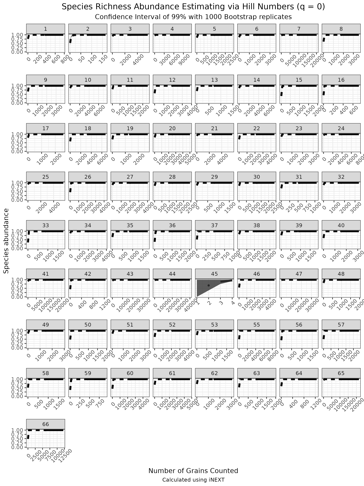

```{r setup, include=FALSE}
knitr::opts_chunk$set(echo = TRUE, warning = FALSE)
```

```{r Required Libraries, message=F, warning=F, results='hide', echo = F}
library(here)
library(tidyverse)
library(bookdown)
library(knitr)
suppressWarnings(library(kableExtra))
pNumC <- function(...) prettyNum(...,big.mark = ',')
#print(citation('spdep'), bibtex=TRUE)
```

# 1 | INTRODUCTION

The inability to reliably identify plants to the level of species often leaves our understanding of ecosystem function and interactions wanting. Current methods to ameliorate this situation include: ignoring these ecologically relevant levels of detail, revisiting plots as diagnostic material becomes temporally available, assistance from taxonomic specialists, or the use of barcoding or other molecular techniques. These approaches are untenable in light of the benefits offered by: species in several morphologically difficult genera which serve as bioindicators, preferred partners in ecological interactions, as well as an increasing lack of taxonomic experts (@hebert2003biological). Many genera, especially with the formalized advent of integrative taxonomy, have species which are well defined based upon ecological and behavioral rather than morphological properties, the identification of these taxa in degraded areas or without their mutualistic partners is fraught with difficulty. Hindering an understanding of the breadth of habitat which some species occupy, and the interactions they have with other species. 

  The identification of many plant species to terminal taxon is an essential component of nearly all land management programs, where many species in the same genus  (e.g. Sagebrush - *Artemisia* L., Willows - *Salix* L., and Sedges - *Carex* L.) serve as bioindicators (respectively for 'rangelands', streams, and wetlands), as well as in academic research (@Gage2013HistoricalRO, AIM). This endeavour is often mired by lack of diagnostic characters (e.g. flowers, fruits, roots or combinations thereof),  and increasingly the description of cryptic species (@janzen2017nuclear, @oliver2009cryptic). Solutions to this problem are wanting, certain programmes have relied increasingly upon revisiting field sites to identify material using morphological or chemical approaches, whereas academic research has often used high copy number plastid genes as barcodes (Rosentreter et al. 2021, MORE MORE). However, both approaches have significant downsides, the former resource intensive at the landscape scale - and often does not work, while the latter seldom works due to a lack of variability in the currently available barcodes (@liu2014identification).
  
  Recently barcoding, and metabarcoding, have shown considerable promise in all Kingdoms of life. For example …. . With plants the identification of members of certain clades has been quite successful, whereas with others results have been elusive (@liu2014identification, @china2011comparative), while most applications laying along this spectrum (@li2015plant, @kress2007two, @cbol2009dna). Particular challenges with the utilization of high-copy number sequences are associated with their rates of divergence, gene tree conflict, and hybridization (@coissac2016barcodes, @fazekas2009plant) Herein we have resolved major components of the problems of identifying plant material without diagnostic morphological character states using the Angiosperms353 (A353) Hyb-Seq probes (@johnson2019universal), and custom species sequence databases derived via species distribution modelling, and temporal filtering.
  
  Our foundation for increasing the quality of metabarcoding results in plants is reducing the number of possible plant species candidates by generating user selected sequence databases relevant to the spatial extent of the study region. While there are numerous possible approaches for this process, we achieve the selection of possible plant candidate species using digital collections gleaned from herbaria, survey work, and citizen science (e.g. iNaturalist), from a domain exceeding the study area. To these candidate species, modelling approaches - such as logistic regression, may be used to identify distances under which taxa warrant further exploration. To these candidate species, we generate species distribution models (SDM's), which indicate the probability of suitable habitat in a domain, and base the inclusion of these taxa, or representative congeners, upon these results. This approach has the additional benefit of greatly reducing the size of a sequence database, which allows for the usage of genomic size data on personal computers. Moreover, as most next-generation sequence data is deposited as raw-sequence reads, from a processing perspective, it is essential to reduce the candidate species via an approach as such.
  
  Currently the largest plant systematic endeavor ever undertaken, the Kew Plant and Fungal Tree of Life (PAFTOL), is approaching completion (@baker2021PAFTOL). This dataset will contain Hyb-Seq data from at least one species representing each genus in the plant kingdom using the popular A353 probes (@baker2021exploring), resulting in over 14,000 represented species. These publicly available data serve to provide a taxonomically comprehensive backbone for plant metabarcoding. Data from the 10kP project, which seeks to develop reference genomes from a phylogenetically diverse suite of plants will contribute many more records upon it's intended completion, now slated to be by 2030, similar projects which seek to sequence high amounts of genomes in regions e.g. the 'Darwin Tree of Life' are being undertaken which will contribute data for applicable to enormous spatial domains (@cheng2018tenkp, @darwin2022project, @lewin2022biogenome).
  
  Considerable amounts of species interactions are expressed along time (@caradonna2021seeing). For the tropics the flowering periods of many plant species display high seasonality, and given the elevated rates of species richness relative to the temperate, this axis may provide an essential filter for identifying material in many metagenomic samples (@janzen1967synchronization, @Newstrom1994ANC). While many pollination interactions are formed and dissolved along the temporal axis in the temperate regions (@caradonna2017interaction), the overall shorter extent of the active growing season in these systems results in the presence of few to any natural breaks in these systems which subjugates the utility of these to perform as filters of post-processing results, rather than distinct species assemblage for database generation. Nonetheless, we work through a process which seems applicable to the tropics to utilize the temporal dimension for classifying sequencing results. 
  
  We apply these metagenomic and informatics approaches to determine whether the foraging record of Queen Bumble Bee's is consistent across direct observations and the pollen record, an incongruency in several floral visitation networks (@barker2021pollen, @zhao2019topology, @alarcon2010congruence). The two foraging phases of the Queen Bumble Bee life cycle is essential to 1) increase their weight before diapause, 2) increase their ovary weights while establishing their recently found nests, both of these time periods represent potential demographic bottlenecks in bumble bee populations (@sarro2022bumble). Bumblebees are one of the only groups of insects with unequivocal quantitative evidence for numerous populations declines, while simultaneously serving as the most effective pollinators in temperate montane ecosystems (@cameron2020global, @goulson2008decline, @williams1982distribution, @colla2012assessing, @bergman1996micrometeorological, @bingham1998efficient). These montane ecosystems represent some of the most ecologically resilient and resistant systems in the temperate and offer unparalleled potential as refugial areas for multiple dimensions of biodiversity under climate change. 

# 2 | METHODS

## Study System & Field Work

Observations and sample collection was conducted at The Rocky Mountain Biological Laboratory (RMBL; 38°57.5" N, 106°59.3" W (WGS 84), 2900 m.a.s.l.), Gunnison County, Colorado, USA (*APPENDIX 1* for site information). Pollinator observations of *Bombus* Latreille spp. (Apidae Latreille) were conducted from June - August of 2015. Observations of *Bombus* foraging took place for one hour at each field site in three 100m transects, where all flowers were also counted and place into abundance bins. Corbiculae loads were,  non-lethally, collected once from all Queen individuals encountered. The six study sites are in areas characterised by high-montane/subalpine Parkland vegetation communities.

### 2.1 | Spatial Analyses

#### 2.1.1 Candidate Species

To develop an ecologically relevant list of vascular plant species, with expected biotic pollination, which may be present at the study sites all records adjacent to the field site were downloaded from the Botanical Information and Ecology Network 'BIEN' (@bien2022), and these taxa had Species Distribution Models (SDMs) generated to predict their suitability. The predicted plant species served as a reference for which species to include in the genomic sequence databases. 

In order to minimise the number of species for which SDM’s were to be generated, BIEN was queried at a distance of up to 100km from our field site and all plant species records were downloaded. In order to emulate the perceived stochasticity of collections, this dataset was bootstrap re-sampled 250 times, with 90% of samples selected, to create a testing dataset. The median of the logistic regression assessing the probability of occurrence of a species record as a function of distance from the study area was used as a threshold distance, under which, to include species as candidates for distribution modelling.

#### 2.1.2 Distribution Modelling

Species had all records from BIEN within a 50km border of the Omernik level 3 ecoregion which the site is located in *(No. 21 "Southern Rockies")*, downloaded (n = 23,919) (@omernik1987ecoregions). These records were copied into two, initially identical, sets, one for generating machine learning models (Random Forest, and Boosted Regression Tree's), and the other for Generalised Linear (GLM) and Generalized Additive Models (GAM). The set for generating GLM and GAM records was thinned to reduce spatial autocorrelation in the dataset, as measured by Morans Index (@moran1950notes, @spdep). To both datasets an additional 4029 plots collected from a random stratification of 19% of the land cover in the area of analysis were searched to create true absences (BLM CITATION - need appropriate format for journal). To achieve a larger absence dataset 1000 pseudo-absence records were generated for each taxon, each of which was greater than 10km from an occurrence record. For ML models, these pseudo-absences were reduced so that the ratio of presence to absence records were balanced. To achieve this, absence records inside of 10% of the mean sample value of the presence records, for any predictor were removed; the required number of absence records were then randomly sampled. 

Species abiotic niche predictors were 26 variables at 30m resolution, six related to climate,  five soil, four topographic, four related to cloud cover, with the remaining reflecting assorted abiotic parameters (@wilson2016remotely, @wang2016locally, @hengl2017soilgrids250m, @robinson2014earthenv) (*APPENDIX 6*). For linear regression models these predictors underwent both vifstep (theta = 10, max observations = 12,500) and vifcor (theta = 0.7, max observations = 12,500), and collinear features were removed leaving 16 variables (@usdm2014). 

Modelling: Random Forest and Boosted Regression Trees, were sub sampled with 30% test and two replicates each before weighted ensemble based on True Skill Statistics (tss) (@sdmPackage). Generalised linear models (GLM) and Generalised additive models (GAM) with 30% sub sampling and three replicates each were also ensembled using the tss (@sdmPackage). The results of these models were extracted to a polygon feature derived from a minimum-spanning tree which encompasses the study area, and species from either ensemble with greater than 50% habitat suitability were considered present for further purposes (@prim1957minimum).

535 species were modelled using Generalized Linear Models and Generalized Additive Models. 534 species were modelled using Random Forest and Boosted Regression Trees.  To evaluate the accuracy of the species distribution models, additional presence records from GBIF (n = 61,789), and AIM (n = 12,730) were used as test and training sets (n = 74,519) for logistic regression (CITE AIM AND GBIF). Additional novel absence records were generated from the AIM dataset to create a dataset where each species has balanced presence and absences. 11 or more paired presence and absence records were required for this testing, resulting in 334 species being included in the logistic regression (Mdn = 110.0, $\bar{x}$ = 223.1, max = 1568 record pairs used) with a 70% test split (@caret). 

## 2.2 | Molecular Lab Work

All lab work was carried out at The Daniel F. and Ada L. Rice Plant Conservation Science Center at the Chicago Botanic Garden, Glencoe, Illinois, U.S.A. 

#### 2.2.1 | Reference Plant Library Generation

Using 5 years of observational data on *Bombus* Queen Bee foraging at these studies sites, we identified the plant taxa most frequently visited by Queens across all years. We sequenced the 12 most commonly visited taxa twice using samples from one site within the Gunnison River Drainage and one individual from another population. In addition, for any of these 12 focal species which did not have a congener pair in this filtered sample, we included a congener - or a species from a closely related genus to serve as an outgroup. We also sequenced another 15 abundant taxa commonly visited by *Bombus* workers, based on the aforementioned data set (*APPENDIX 4*).

#### 2.2.2 | Plant Genomic DNA Extraction

Plant genomic DNA was isolated from ~ 1 cm^2^ of leaf tissue from silica-gel dried or herbarium material using a modified cetyltrimethylammonium (CTAB) protocol (@doylesCTAB) that included two chloroform washes. DNA was quantified using a Nanodrop 2000 (Thermo Fisher Scientific, Waltham, Massachusetts, USA) and Qubit fluorometer (Thermo Fisher Scientific).

#### 2.2.3 | Pollen Genomic DNA Extraction

Pollen genomic DNA was extracted from corbiculae using a CTAB based protocol modified from Lahlamgiahi et al. and Guertler et al. (2014, 2014). A SDS extraction buffer (350µL , 100mM Tris-HCl, 50 mM EDTA, 50 mM NaCl, 10% SDS v/v., pH 7.5) was added followed by vortexing to allow dissolution of corbiculae. Pollen grains were then macerated with Kontes Pellet Pestles, and the tip of these washed with 130 µL of the SDS extraction buffer, samples were then incubated for 1 hour at 30°C. This was followed by the addition of 10% CTAB solution (450ul, of 20 mM Tris-Cl pH. 8.0, 1.4 M NaCl, 10 mM EDTA pH 7.5, 10% CTAB, 5% PVP, ~85% Deionized water) and RNAse (10 uL of 10 mg/mL) and samples were incubated for 40 minutes at 37°C, on heat block (Multi-Blok, Thermo Fisher Scientific, Waltham Massachusetts) set to 40°C. After 20 minutes incubation, Proteinase K (15 µL of 20mg/ml) and  DTT (12.5 µL of 1M in water) were added, and the samples were further incubated at 60°C for 1 hour. Samples were then incubated overnight at 40°C. 500 µL of Phenol-Chloroform-Isoamyl alcohol (25:24:1) were added, vortexed, and centrifuged at 10,000 rpm for 10 minutes and the aqueous phase was pipetted to a 1.5 ml centrifuge tube.

To precipitate the DNA, chilled Isopropyl alcohol & 3 mM Sodium acetate (5:1) equivalent to 2/3 of the volume of sample were added, with 1 hour of chilling at -20°C, followed by 10 minutes of centrifuging at 13,000 rpm. The supernatant was pipetted to a new 1.5 ml centrifuge tube, and 70% EtOH (400 µL) were added before chilling at -20°C for 20 minutes followed by centrifugation at 13,000 rpm for 10 minutes. Both tubes were then washed with  75% EtOH (400 µL), inverted, centrifuged at 13,000 rpm for 4 minutes, and the solution discarded, then washed with 95% EtOH (400 µL) , inverted, centrifuged at 13,000 rpm for 4 minutes, and the solution discarded. Pellets were dried at room temperature overnight before resuspension in Nuclease free H2O.  Extractions were assessed using a Nanodrop 2000 (Thermo Fisher Scientific) and Qubit fluorometer (Thermo Fisher Scientific). DNA extracts were then cleaned using 2:1 v./v. Sera-Mag beads (Cytiva, Little Chalfont, UK) to solute following the manufacturer's protocol, eluted in 0.5x TE, and the eluent allowed to reduce by half volume in ambient conditions. DNA was quantified using a Qubit fluorometer. 

#### 2.2.4 | Fragmentation, Library Preparation & Target Enrichment

Library preparation was performed using the NEBNext Ultra II FS-DNA Library Prep Kit for Illumina (New England BioLabs, Ipswich, Massachusetts, USA) using slightly modified manufacturers recommendation.  Fragmentation was performed at ½ volume of reagents and ¼ enzyme mix for 40 minutes at 37*C, with an input of 500 ng cleaned DNA. Adapter Ligation and PCR enrichment were performed with ½ volumes, while cleanup of products was performed with ½ volume of SPRI beads (Beckman Coulter, Indianapolis, Indiana, USA) and recommended volumes of 80% v./v. ethanol washes. The exception was the herbarium specimens which were not fragmented and only end repaired, with similar library preparation of all samples. Products were analysed on 4% agarose gels, and a Qubit fluorometer. 
Libraries were pooled and enriched with the Angiosperms 353 probe kit V.4 (Arbor Biosciences myBaits Target Sequence Capture Kit) by following the manufacturer's protocol and Brewer et al. 2019. Sequencing was performed using an Illumina mi-Seq with 150-bp end reads, (NUSeq Core, Chicago, Illinois).

###  2.2.5 | Computational Processes and Analyses. 
####  2.2.5.1 | Reference Library Data Processing

Sequences were processed using Trimmomatic, which removed sequence adapters, clipped the first 3 bp, discarding reads less than 36 bp, and removing reads if their average PHRED score dropped beneath 20 over a window of 5 bp (@bolger2014trimmomatic, @tange_2022_6377950). Contigs were generated using HybPiper using target files created by M353 (@johnson2016hybpiper, @mclay2021new). 

#### 2.2.5.2 | Sequence Identification

A custom Kraken2 database was created by downloading representative species of each genus indicated as being present in the study area by the spatial analyses from the Sequence Read Archive (SRA) NCBI (@wood2019improved). These sequences were processed in the same manner as our novel sequences before being placed into the database. The Kraken2 database was built using default parameters. Kraken2 was run on sequences using default parameters (*APPENDIX 5*). 
  Following Kraken2, Bracken was used to classify sequences to terminal taxa (@lu2017bracken). Results from both Kraken2 and Bracken, results were reclassified manually to identify terminal taxa. For example, when only a single species of a genus was known in the study area, but our database used a representative of another taxon in the genus, this species was coded as the result. The re-coding of sequences from another representative species for the genus to the sole RMBL representative allowed the identification of XX & % more species. 

#### 2.2.5.3 | Identification of Sequence Matching Loci

A local NCBI database was built using the same processed novel and downloaded sequences (@camacho2009blast). 

## 2.2.5.4 | Morphological Pollen identification

To develop a reference library of  pollen grains which may be present in corbiculae loads, an image reference collection of fuchsin-jelly stained (@beattie1971technique) slides was assembled from slides previously prepared by the authors (n = 21), and other researchers (n = 38) (@brosi2013single). Using 5 years of observational data on *Bombus* Queen Bee foraging at these studies sites (Ogilvie unpublished), as well as the Vascular Plant Checklist (@fraser2007vpc), an additional 62 voucher slides for species were prepared and imaged at 400x (Leica DMLB, Leica MC170 HD Camera, Leica Application Suite V. 4.13.0) from non accessioned herbarium collections to supplement the number of species and clades covered (Appendix 3).  
  In order to determine which plant taxa were distinguishable via light microscopy, and to develop a dichotomous key to pollen morphotypes, Divisive Hierarchical Clustering techniques were used. Ten readily discernible categorical traits were collected from each specimen in the image collection. These traits were transformed using Gower distances, and clustered using Divisive Hierarchical clustering techniques (@cluster2022). Using the cluster dendrogram, elbow plot, and heatmaps (@fpc2022), of these results morphological groups of pollen which could not be resolved via microscopy were delineated, and a dichotomous key was prepared (APPENDIX NO.). This key was then used to identify the pollen grains sampled from corbiculae loads to morphotypes in a consistent manner. 
  To prepare the pollen slides from corbiculae, all corbiculae loads were broken apart and rolled using dissection needlepoints to increase heterogeneity of samples. *Cerca* 0.5mm^2 of pollen was placed onto a ~4mm^2 fuchsin jelly cube (@beattie1971technique) atop a graticulated microscope slide, with 20 transects and 20 rows (400 quadrants) (EMS, Hartfield, PA). The jelly was melted, with stirring, until pollen grains were homogeneously spread across the microscope slide. Slides were sealed with Canada Balsam (Rublev Colours, Willits, CA) followed by sealing with nail polish; all samples are noted in *APPENDIX 3*.
  To identify the pollen present in corbiculae loads, light microscopy at 400x (Zeiss Axioscope A1) was used. In initial sampling in three transects, each pollen grain was identified to morphotype and counted; an additional two transects were scanned for morphotypes unique to that slide, if either transect contained an unique morphotype than all grains in that transect were also identified and counted. Subsequent to the first round of sampling, non-parametric species richness rarefaction curves (@vegans2022), and non-parametric species diversity rarefaction curves were used to assess the completeness of sampling (@inextArticle, @inextPackage). Slides not approaching the asymptote of the rarefaction curve were then re-sampled, and analysed iteratively for up to a total of seven transects *APPENDIX 2*. 

### 2.3 | Temporal Analyses

To estimate the duration of dates in which plant species were flowering weibull estimates of several phenological parameters all spatially modelled taxa were developed (@belitz2020accuracy, @pearse2017statistical). Only BIEN records which occurred in the Omernik Level 4 Ecoregions within 15km of the study area (n = 5, or conditionally 6 if enough records not be found in the nearest 5), and which were from herbarium records were included. To remove temporally irrelevant herbarium records, i.e. material collected during times which flowering is impossible at the study area due to snow cover, the SnowUS dataset (@iler2021conceptual, @tran2019cloud) from 2000-2017 was analyzed for the first three days of contiguous snow absence, and the first three days of contiguous snow cover in Fall. Herbarium records after the 3rd quantile for melt, and the 1st quantile for snow cover of these metrics were removed. Species with > 10 records had their weibull distributions generated for the date when 10% of individuals had begun flowering, when 50% were flowering, and when 90% of individuals had flowered.

### 2.4 | Floral Observations

# 3 | RESULTS

## 3.1 | Spatial Analyses

```{r Results for SA Modelling, echo = F, message = F, warning = F}

files <- list.files('/hdd/MS_SDM_RMBL/SDMS_RMBL/results/maps', pattern = 'tif$')
ml <- files[grep( '_ml_', files)]
ml <- unique(sub('_ml.*$', '', ml)) # ensure we do not have dupes
linear <- files[grep('_glm_', files)]
linear <- unique(sub('_glm.*$', '', linear))

# setdiff(linear, ml) # Barbarea vulgaris, epilobium lactiflorum not modelled with ml
# setdiff(ml, linear) # ericameria parryi not modelled with 'linear regression'

rm(files, ml, linear)
```

```{r Results for SA Logistic Regression Metrics, echo = F, message = F, warning = F}

logR_dat <- read.csv('../data/PA_records_logistic_regression.csv')[,2:4] %>% 
  filter(occurrence == 0) 
# summary(logR_dat$n)
# sum(logR_dat$n)

dat <- read.csv('../data/evaluation_table.csv')[,2:3]
data.frame(Metric  = dat[1:5,1],
                   Value   = dat[1:5,2],
                   Metric1 = dat[6:10,1],
                   Value1  = dat[6:10,2]
                   ) %>% 
  knitr::kable(caption = "Logistic regression assessing accuracy of SDMs",
    col.names = c('Metric', 'Value', 'Metric', 'Value'),
    booktabs = T) #%>% 
  #kableExtra::kable_styling(position = "float_right")
```

```{r Results for SA Logistic Regression Contingency table, echo = F, message = F, warning = F}
read.csv('../data/Pa_conting_table.csv') %>% 
    knitr::kable(caption = "SDM evaluation contingency table",
    col.names = c('', ' Absence ', '  Presence  ', ' Absence ', ' Presence '), align = "lrrrr",
    booktabs = T) %>%
    add_header_above(c(" " = 1, "Training" = 2, "Testing" = 2))

rm(logR_dat, dat)
```

The median (25.009 km) of the logistic regression assessing the probability of occurrence of a species record as a function of distance from the study area was used as a threshold distance to include species for distribution modelling. A 2-sample test for equality of proportions with continuity correction (X-squared = 13.254, df = 1, p-value = 0.000136, 95% CI 0.04-1.00) was used to test whether more of the records located in the broad ecological sites present at the field station, between the distance of the median (25.009 km) to the third quantile (ca 43.830 km) of the regression distance, where true presences at the field station. Including these records would have resulted in modelling an additional 222 species distributions of which 30 are true presences these taxa were not modelled.  

Across the entire spatial domain of modelling all ensembled models (n = 968) had an accuracy of 0.84 (95% CI 0.8356 - 0.8443), kappa 0.68, p-value < 0.001, sensitivity = 0.80, specificity = 0.87.

At the field site, of the 554 vascular plants with biotic pollination syndromes, the 493 ML ensembles accurately predicted the presence of 362 (65.3%), incorrectly predicted the presence of 64 (11.6%), incorrectly predicted 34 true presences (6.1%) as being absent, and correctly predicted the true absence of 33 (6.0%). The balanced accuracy of the ensembled models is 0.627 (Sensitivity = 0.340, Specificity 0.914). Of the 554 vascular plants with biotic pollination syndromes, the 475 LM ensembles accurately predicted the presence of 286 (51.6%), incorrectly predicted the presence of 41 (14.3%), incorrectly predicted 93 true presences (16.8%) as being absent, and correctly predicted the true absence of 55 (9.9%). The balanced accuracy of the ensembled models is 0.664 (Sensitivity = 0.573, Specificity 0.754). Of the 554 vascular plants with biotic pollination syndromes in the flora 13 (2.3%) were in the Orchid family and 41 (7.4%) are non-natives, both of which are restricted from the database, and can only reduce the number of true predicted presences by roughly 10%. 

At the six study plots, of the 117 plant species identified to the species level across the spatial extents of all plots and duration of queen bee activity, the ML ensembles predicted the presence of 105 (89.7%) of them, and LM ensembles 102 (87.2%). Of the missing species two (1.7%) are Orchids, six (5.1%) are non-native, and one (0.85%) is of contested taxonomic standing, all of which (7.65%) are restricted from the initial query database. 

## 3.2 | Microscopic Pollen identification
```{r, echo = F}
a <- c('Trifolium', 'Lupinus', 'Glyccrrhiza', 'Mitella', 'Geum')
b <- c('Lupinus', 'Lathyrus', 'Potentilla', 'Androsace', 'Bistorta', 'Vicia')
c <- c('Jeffersonia', 'Micranthes', 'Prunus', 'Delphinium', 'Androsace', 
       'Penstemon', 'Orthocarpus', 'Scuttelaria', 'Aquilegia', 'Castilleja', 'Draba')
d <- c('Salix', 'Boechera')

# Do we detect mertensia, asteraceae 1, asteraceae 2, in all molecular samples which they are present in the pollen samples of?

```


Using the fuchsin jelly preparation and light microscopic analyses of grains and scoring of 10 character states resulted in the establishment of 28 morphotypes which grains could be classified into. *APPENDIX 7*. 60 samples were counted and based on rarefaction **had over % of expected morphotypes found** (morphotype richness, $\bar{x}$ = 4.5, Mdn = 4, min = 1, max = 9), all samples had expected morphotype diversity reach the asymptote *APPENDIX 8*. The number of counted pollen grains in each sample range from (*MIN* - 16,293, $\bar{x}$ = 2788.685, Mdn = 1453). 

## 3.3 | Metabarcoding Pollen identification

```{sh Get number of raw and trimmed reads for metagenome samples, eval = F, echo = F}

cd ~/sequenceData/Original_zip
files=$(find -type f -name "[0-9]_S[0-9]*_paired.fastq.gz") # doesnt support {2}
files1=$(find -type f -name '[0-9][0-9]_S[0-9]*_paired.fastq.gz')
files="${files} ${files1}"
echo $files
# seqs per each sample , need divide by 4 on import
wc -l  $files > '/hdd/yun master/MEE_manuscript/data/raw_reads_metagenome_seq.txt'

cd ../trimmed_metagenomic
files=$(find  -maxdepth 1 -name '*gz')
wc -l  $files  > '/hdd/yun master/MEE_manuscript/data/trimmed_reads_metagenome_seq.txt'
```

```{r sequence numbers, echo = F}

raw_seqs <- read.delim('../data/raw_reads_metagenome_seq.txt', header = F) %>% 
  mutate(V1 = str_trim(V1)) %>% 
  separate(V1, c('seq', 'sampleFR'), sep = ' ') %>% 
  mutate(seq = round(as.numeric(seq)/4),
         sample = str_extract(sampleFR, '.*L002_')) %>% 
  filter(sampleFR != 'total') %>% 
  group_by(sample) %>% 
  mutate(totalReads = sum(seq)) %>% 
  distinct(totalReads) %>% 
  pull(totalReads)

trimmed_seqs <- read.delim('../data/trimmed_reads_metagenome_seq.txt', header = F) %>% 
  mutate(V1 = str_trim(V1)) %>% 
  separate(V1, c('seq', 'sampleFR'), sep = ' ') %>% 
  mutate(seq = round(as.numeric(seq)/4),
         sample = str_extract(sampleFR, '.*paired')) %>% 
  filter(sampleFR != 'total') %>% 
  group_by(sample) %>% 
  mutate(totalReads = sum(seq)) %>% 
  distinct(totalReads) %>% 
  pull(totalReads)

krak <- read.csv('../data/kraken_proc_reads.csv')
brack <- read.csv('../data/bracken_proc_reads.csv')
blast <- read.csv('../data/blast_proc_reads.csv')
loci <- read.csv('../data/reads_per_loci.csv') %>% group_by(Sample)
  
no_loci <- loci %>% group_by(Sample) %>% count(name = 'no_loci')
no_reads <- loci %>% group_by(loci) %>% summarize(readsLoci = sum(n))
```

54 corbiculae loads had DNA extracted and underwent various steps towards hyb-seq, in the end a total of `r toString(length(raw_seqs))` corbiculae samples were sequenced, `r pNumC(sum(raw_seqs))` reads were recovered from sequencing. The number of reads per sequence varied widely (range = `r pNumC(min(raw_seqs))` - `r pNumC(max(raw_seqs))`, $\bar{x}$ = `r pNumC(round(mean(raw_seqs),1))`, Mdn = `r pNumC(median(raw_seqs))`). Of the possible 353 loci, the number which were recovered from each sample, and informative to BLAST were range = `r toString(min(no_loci$no_loci))` - `r toString(max(no_loci$no_loci))`, $\bar{x}$ = `r toString(round(mean(no_loci$no_loci), 1))`, Mdn = `r toString(median(no_loci$no_loci))`. The number of reads per loci from across all samples had a range of `r min(no_reads$readsLoci)` - `r pNumC(max(no_reads$readsLoci))`, $\bar{x}$ = `r pNumC(round(mean(no_reads$readsLoci), 1))`, Mdn = `r pNumC(median(no_reads$readsLoci))`.

**APPENDIX X**.

After trimming `r pNumC(sum(trimmed_seqs))` sequences remained. `r pNumC(sum(krak[krak$Classified == 'C',]$n))` reads were matched using Kraken, of the reads classified by Kraken `r pNumC(sum(brack$reads))` reads were matched using Bracken, of the reads classified by Kraken `r pNumC(sum(blast$Total_seqs))` reads were matched using BLAST.  

Based upon subjective review of the three classifiers, BLAST was chosen as the classification method which yielded the most probable results, and it's values were used for all subsequent analyses. 

```{r, eval = F, echo = F}
rm(toseq, krak, brack, blast, loci, no_loci)
```

## 3.4 | Temporal Analyses

The first date of modeled snow melt in the Gothic area (n = 17, $\bar{x}$ = 137.9, Mdn = 135, 3rd quantile = 151), and the first date of a consistent winter snow base (n = 17, $\bar{x}$ = 299.9, Mdn = 300, 1st quantile = 291) from 2000-2017, were used as delimiters for the inclusions of herbarium records in modelling. Of the **500** species predicted likely present in the area via logistic regression, 332 species (64.4%) with more than 10 records in the focal level 4 ecoregions ($\bar{x}$ = 35.01657, Mdn = 35, max = 96) had weibull estimates calculated, an additional 56 species (11.2%) with enough contributing records from the 'Sedimentary Mid-Elevation Forests', a large ecoregion in general just beneath the elevation bands occupied by the five ecoregions around the study area had weibull estimates also calculated ($\bar{x}$ = 13.86885, Mdn = 13, max = 24).

Only 58 of these 388 species (n = 34.56897, Mdn = 31) were able to be compared to plot based observational data from the long term (1974–2012) dataset. Of these species relatively high accord was observed between the long-term ground truthed dataset, and the modelled species. There was very strong evidence that the weibull estimates were positively associated with the observed onset (r^2^ = 0.72, p < 0.0001, tau = 0.61) and peak (r^2^ = 0.70, p < 0.0001, tau = 0.65) of flowering, and that the number of herbarium samples had a moderate effect on the estimates (p = 0.004 and p = 0.034 respectively). There was very strong evidence that the weibull estimates had a positive association with the observed cessation of flowering (r^2^ =  0.4339,  p < 0.0001, tau = 0.489), however their was no evidence that sample size had an effect (p = 0.349). There was moderate evidence that the weibull estimates, with an effect of sample size, had a weak positive association with the observed duration of flowering (p = 0.0401, r^2^ = 0.07, tau = 0.17).

```{r phenology estimates, echo=F, fig.cap="A caption", out.width = '75%'}
knitr::include_graphics("../graphics/plots/phenology_estimates_10_90.png")
# these are the tenth and nintey  percent non-parametric confidence intervals. 
```

## 3.5 | Floral Observations 

```{r Floral Obs Results, echo = F, warning = F}

files <- list.files('../data', pattern = 'csv')

flr_ranks <- read.csv(
  file.path('../data',  files[grep('flower_ranks', files)] )) %>% 
  select(site, doy, week, tot.obs.length, habitat, plant.species:abun.rank)
obs_time <- read.csv(
  file.path('../data', '/', files[grep('queen_observations', files)]) ) %>% 
  select(site, week, tot.obs.length) %>% 
  distinct(site, week, .keep_all = T)

bee_obs <- read.csv(
  file.path('../data', files[grep('queen_observations', files)]) ) %>% 
  filter(caste == 'q') %>% 
  mutate(species = gsub('\\..*$', '', species)) %>% 
  select(site, doy, week, tot.obs.length, species, plant.species,
         resource.coll:pollen.collected, fl.switch.1:fl.switch.2.resource.coll) %>% 
  mutate(across(resource.coll:fl.switch.2.resource.coll, ~ na_if(.x, ''))) %>% 
  pivot_longer(c(plant.species, fl.switch.1, fl.switch.2), names_to = 'observation', values_to = 'plant.species') %>% 
  drop_na(plant.species) %>% 
  group_by(site, week, species, plant.species) %>% 
  count(name = 'interactions') %>% 
  left_join(., obs_time, by = c("site", "week")) %>% 
  mutate(period = case_when(
    week %in% 3:5 ~ 'Early',
    week %in% 6:8 ~ 'Mid',
    week %in% 9:11 ~ 'Late'
  ))

s <- toString(format(as.Date(min(flr_ranks$doy), origin = "2016-01-01"), "%B %d")) # start obs
e <- toString(format(as.Date(max(flr_ranks$doy), origin = "2016-01-01"), "%B %d")) # end obs

t_b_wk <- bee_obs %>%  group_by(site, week, species) %>%  tally(interactions) 
t_b_b <- bee_obs %>%  group_by(species) %>%  tally(interactions) %>%  filter(species != 'unknown') 
t_b_wk_pl <- bee_obs %>%  group_by(site, week, plant.species) %>%  tally(interactions) 
t_b_pl <- bee_obs %>%  group_by(plant.species) %>%  filter(species != 'unknown') %>%  tally(interactions) 
t_spp_i <- bee_obs %>%  group_by(species) %>%  filter(species != 'unknown') %>%  distinct(plant.species) %>% 
  count()

```

The six sites were surveyed for a total of `r toString(sum(obs_time$tot.obs.length)/60)` hours from `r s`-`r e`. A total of `r toString(sum(bee_obs$interactions))` queen-pollen foraging interactions were observed (range per bee species by week range = `r toString(min(t_b_wk$n))` - `r toString(max(t_b_wk$n))`, $\bar{x}$  = `r toString(round(mean(t_b_wk$n), 2))`, Mdn = `r toString(median(t_b_wk$n))`), with a range of total observed interactions per bee species across this time period (min = `r toString(min(t_b_b$n))`, $\bar{x}$  = `r toString(round(mean(t_b_b$n), 2))`, Mdn = `r toString(median(t_b_b$n))`, max = `r toString(max(t_b_b$n))`). Plants varied widely in the number of interactions which they partook in with each species of bee (range per plant species by week min = `r toString(min(t_b_wk_pl$n))` - `r toString(max(t_b_wk_pl$n))`, $\bar{x}$  = `r toString(round(mean(t_b_wk_pl$n), 2))`, Mdn = `r toString(median(t_b_wk_pl$n))`), with a range of total observed interactions per plant species over this time period (min = `r toString(min(t_b_pl$n))`, $\bar{x}$  = `r toString(round(mean(t_b_pl$n), 2))`, Mdn = `r toString(median(t_b_pl$n))`, max = `r toString(max(t_b_pl$n))`). The number of plant species which bees were observed interacting with varied more narrowly (range = `r toString(min(t_spp_i$n))` - `r toString(max(t_spp_i$n))`, $\bar{x}$  = `r toString(round(mean(t_spp_i$n), 2))`, Mdn = `r toString(median(t_spp_i$n))`).

A total of 66 corbiculae loads were collected from Bees, 64 of them from Queens. 

```{r echo = F}
rm(bee_obs, flr_ranks, obs_time, t_b_b, t_b_wk, t_b_pl, t_b_wk_pl, e, s, files, t_spp_i)
```


```{r Most used resources by species, eval = F, echo =F}

corb <- read.csv('../data/Corbiculae_collections.csv', header = F) %>% 
  mutate(sample.id = as.numeric(str_extract(V1, '[0-9]{1,2}')),
         species = str_extract(V1, 'Bombus [^ ]+'),
         caste = str_trim(str_extract(V1, '[:space:][q|w][:space:]'))) %>% 
  filter(caste == 'q') %>% 
  select(-V1, -caste)

blst <- read.csv('../data/classified_blast.csv') %>% 
  distinct(sample.id)

blst <- read.csv('../data/classified_blast.csv') %>% 
  mutate(across(where(is.character), ~ replace_na(., 'UNKNOWN'))) %>% 
  arrange(sample.id, -Prcnt_seqs) %>% 
  inner_join(., corb, by = 'sample.id') 
  
blst_cnt <- blst %>% 
  distinct(sample.id, .keep_all = T) %>% 
  count(species)

tb <- blst %>% 
  left_join(., blst_cnt, by = 'species') %>% 
  group_by(species, name) %>% 
  mutate(Mu_Seqs = sum(Prcnt_seqs)/n)  %>% 
  distinct(species, name, .keep_all = T)

tb %>% 
  filter(species == 'Bombus appositus') %>% 
  ungroup() %>% 
  mutate(total = sum(Mu_Seqs))

obs <- read.csv('../data/yearEndInteractionsObservations.csv')[,2:5] %>% 
  group_by(species) %>% 
  arrange(species, -bySpp) %>% 
  slice_head(n = 10)

```

# 4 | DISCUSSION

Although we were able to use an actually fine scale flora to determine the species present at the field site, we suspect a similar approach may be accomplished via quick species richness inventories at sites, and then utilizing a bootstrap approach akin to ours, to the taxa returned from databases to derive these estimates. 


** Mention in here that the general effect of sample size on predictions means that larger samples sizes are required for this to work!!!! **
Although our temporal results were lackluster, we note that our study area has an incredibly brief growing period. and we suspect these temporal results would be useful in sub-tropical and tropical ecosystems. FURTHER, the sites used for ground truthing the temporal flowering periods were not randomly selected across the study area, and cannot be used to make inference to the population across the entirety of the study area as we did here. Regardless both show good agreement on flower onset, peak flowering, and moderate agreement with flowering cessation. The disagreement in flowering cessation is perhaps due to more microclimates which retain water, rather than microclimates which allow the early accumulation of heat. 

Fewer modelling runs for SDM's likely to be effective for determining inclusion, elastic inclusion criteria. The actual dataset which was used for training and testing all of the models incorporated into SDM's represented only roughly one quarter of the records available for such purposes. We consciously chose to do this in order to showcase the possibility of this approach working in less data rich areas. 

Bayesian framework


Future Directions:

While at the time of writing this there are limited A353 sequence data, the Plant and Fungal Trees of Life (PAFTOL) project, which is sequencing at least a species of each genera in the plant Kingdom will produce sequence data from over 14,000 species. Given the extant publicly available genomic data, we conservatively estimate that upon completion of PAFTOL there will be no fewer than 15,500 species (4.4% of all ca. 350,000 plant species) for which sequence data of a majority of these loci exist (@govaerts2021world). Accordingly, projects in the near future may increase the number of metagenomics samples while decreasing the need to create their own plant sequence reference libraries. 
  As a result of PAFTOL the first ever comprehensive phylogenetic hypotheses of all plant genera will be presented. In tandem with an increased number of digitised and geo-referenced herbarium specimens, and monitoring programs in natural areas, we believe that geo-informatics, and phylogenetic inference will increase the ability of researchers applying this technique to identifying sequence reads. 
  While our approach emphasises the use of this metagenomic technique for the purpose of identifying pollen, I argue the template and resources we provide here make this approach a suitable candidate for many plant metagenomic tasks. While we did not have the resources to explore the possibility of characterising infraspecific characteristics, preliminary results from others (@wenzell2021incomplete, Loke et al. in prep) indicate a possibility for these probes to also collect data at the level of populations and individuals. **
  
In regards to better understanding the foraging preferences of *Bombus* feeding in subalpine ecosystems. **JANE AND PAUL SET UP FOR NEAR FUTURE RESULTS?**

**AUTHOR CONTRIBUTIONS:**  R.C.B conducted botanical collections, conducted all molecular lab work, lead all analyses, and writing. J.E.O conceived, designed, and conducted all ecological fieldwork, assisted with analyses, and writing. E.J.W. prepared, imaged, and collected trait data on pollen reference slides, and assisted with analysis of trait data and writing a dichotomous key. S.T. assisted with spatial analyses and writing. P.J.C assisted with ecological analyses and writing. J.B.F. conceived, and designed all lab work, analyses, assisted with writing, and secured funding for molecular work. 

**ACKNOWLEDGMENTS:** Nyree Zerega for assistance obtaining herbaria loans and accessioning our collections at CHIC. Pat Herendeen for assistance with virtually all aspects of preparing pollen vouchers and the identification process. Hilary Noble, Zoe Diaz-Martinez, Angela McDonnell, & Elena Loke for assistance with genomic library preparation. We thank the curators at the following herbaria for supplying tissue: Ben Legler at Stillinger (ID), Charles (Rick) Williams at Ray J. Davis (IDS), (B)Ernie Nelson at Rocky Mountain (RM). We thank the original collectors of these specimens: D. Knoke, L. Brummer, J. Boyd, C. Davidson, I. Gilman, M. Kirkpatrick, S. McCauley, J. Smith, K. Taylor, & C. Williams. David Giblin for sharing relevant sections of an advanced draft of FNA V. 15. The Bureau of Land Management is thanked as many plant specimens were collected by R.C.B as a partner or contractor to the agency, Sarah Burnett and Lauren Price are thanked for sharing AIM data. Sanda and NEB are gratefully acknowledged for technical support and generously sharing samples. 

**CONFLICT OF INTERESTS** The authors declare no conflicts of interest.

**PEER REVIEW** The peer review history for this document is available at ...

**DATA AVAILABILITY STATEMENT** The queries required to download all data used in this project are located in... All novel sequencing data are located at NCBI... 

**ORCID**

Paul CaraDonna https://orcid.org/0000-0003-3517-9090  
Jeremie Fant https://orcid.org/0000-0001-9276-1111  
Jane Ogilvie https://orcid.org/0000-0001-8546-0417  
Sophie Taddeo https://orcid.org/0000-0002-7789-1417  

# References


# Supporting 

\newpage

```{r APPENDIX NUMBER LOCI WITH READS USED IN MATCHING, echo = F}
knitr::include_graphics('../graphics/plots/Percent_loci_matched_by_sample.png')
```

\newpage

```{r APPENDIX NUMBER RMBL Pollen Key 1, echo = F}
knitr::include_graphics('../graphics/assorted/RMBL_pollen_key-1.pdf')
```

\newpage

```{r APPENDIX NUMBER RMBL Pollen Key 2, echo = F}
knitr::include_graphics('../graphics/assorted/RMBL_pollen_key-2.pdf')
```

\newpage

Layer                   Description                            Source
----    ----------------------------------------------  ---------------------
1.             Mean annual cloudiness - MODIS            Wilson et al. 2016
2.           Cloudiness seasonality 1 - MODIS            Wilson et al. 2016 
3.           Cloudiness seasonality 2 - MODIS            Wilson et al. 2016 
4.           Cloudiness seasonality 3 - MODIS            Wilson et al. 2016
5.          Beginning of the frost-free period               Wang et al.
6.             Climatic moisture deficit                     Wang et al.
7.             Degree-days above 5C from                     Wang et al.
8.             Mean annual precipitation                     Wang et al.
9.          Mean annual precipitation as snow                Wang et al.
10.             Temperature seasonality                      Wang et al.
11.       2015 Percent Grass/Herbaceous cover - MODIS         (MOD44B)
12.      2015 Percent Tree cover from Landsat 7/8              (GLCF)
13.       Soil probability of bedrock (R Horizon)             SoilGrids
14.         Soil organic carbon (Tonnes / ha)                 SoilGrids
15.              Surface soil pH in H2O                       SoilGrids
16.             Surface soil percent sand                     SoilGrids
17.                   Soil USDA class                         SoilGrids
18.                Topographic elevation                    EarthEnv DEM
19.          Topographic elevation, moving window.          EarthEnv DEM
20.            Topographic percent slope                    EarthEnv DEM 
21.            Topographic wetness index                    EarthEnv DEM 
22.             Topographic aspect from                     EarthEnv DEM
23.      Annual potential solar radiation computed             r.sun
24.       Estimated actual (w/-cloud) solar radiation  r.sun / Wilson et al. 2016
25.       Log-transformed distance to surface water   Global Surface Water Explorer
26.             Percent surface water                 Global Surface Water Explorer 
----    ----------------------------------------------  ---------------------

\newpage

```{r APPENDIX MORPHOTYPE RICHNESS AND ABUNDANCE, echo= F}
knitr::include_graphics('../graphics/plots/species_richness_rarefaction.png')
```

\newpage

```{r, echo = F, out.width = '25%'}

```

\newpage

```{r Voucher Reference Specimen tables 1, echo = F}
knitr::include_graphics('../graphics/tables/specimen_tables-1.pdf')
```

\newpage

```{r Voucher Reference Specimen tables 2, echo = F}
knitr::include_graphics('../graphics/tables/specimen_tables-2.pdf')
```

\newpage