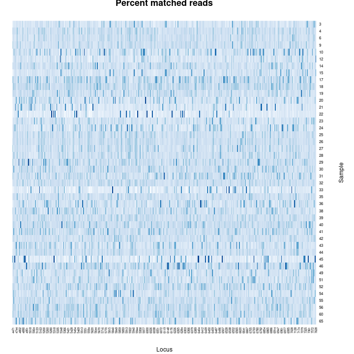

--- 
title: Metagenomic Barcoding of Pollen Loads Offers Insights on the Foraging Patterns of Queen Bumble Bees
author:  |
    |  Reed Clark Benkendorf$^1$$^,$$^2$, Emily J. Woodworth$^1$$^,$$^2$, Jane E. Ogilive$^3$$^,$$^4$,   
    |  Sophie Taddeo$^1$$^,$$^2$, Paul J. CaraDonna$^1$$^,$$^2$$^,$$^3$, Jeremie B. Fant$^1$$^,$$^2$  
    |  $^1$Chicago Botanic Garden, 1000 Lake Cook Road, Glencoe, Illinois 60022, USA  
    |  $^2$Plant Biology and Conservation, Northwestern University, Evanston, Illinois 60208, USA  
    |  $^3$ Rocky Mountain Biological Laboratory, P.O. Box 519, Crested Butte, Colorado 81224, USA
    |  $^4$ Australia post fire project, ----, ----, ----, AU  
    |  Reed Clark Benkendorf^[Correspondence: reedbenkendorf2021@u.northwestern.edu] $^1$$^,$$^2$, Jane E. Ogilvie$^3$$^,$$^4$ , Emily J. Woodworth$^1$$^,$$^2$  
abstract:  |  
  1) DNA Barcoding has been remarkably successful in nearly all kingdoms of life and has allowed for the rapid analysis of ecological assemblages. Successful DNA barcoding in the plant kingdom has been more difficult than other kingdoms. Due to this understanding plants in ecological contexts and understandings of their synecology in some instances may begin to lag behind other kingdoms.  
  2) Here we utilize hyb-seq, museum studies, and species distribution modelling, to detect the plant species present in pollen loads collected from Queen Bumble Bees.  
  3) By utilizing Species distribution modelling we allow for one to process hyb-seq data, create user specified sequence databases which may use MORE ACCURATE alignment algorithms on personal computers over realistic time periods.  
  4) We show that hyb-seq using the Angiosperms 353 probes, which are currently being used in the largest ever plant systematic endeavor, offers significant promise to metagenomic approaches in real world scenarios.  
  5) We conclude that these probes offer promise for the identification of plant tissue in both single sample, and metasample contexts.  
keywords: |
  DNA baroding, metagenomics, hyb-seq, Angiosperms353, plant metagenomics, bombus queens, subalpine, species distribution model
output:
  pdf_document: default
  toc: no
  word_document: default
csl: "../citations/methods-in-ecology-and-evolution.csl"
bibliography: ../citations/citations.bib
link-citations: yes
fig_caption: yes
always_allow_html: true
header-includes:
- \usepackage{endfloat}
- \usepackage{setspace}\doublespacing
- \usepackage{lineno}
- \linenumbers
--- 
    
```{r setup, include=FALSE}
knitr::opts_chunk$set(echo = F, warning = F, message = F)
```

```{r Required Libraries, message=F, warning=F, results='hide'}
library(here)
library(tidyverse)
library(bookdown)
library(knitr)
#devtools::install_github("kpmainali/CooccurrenceAffinity")
suppressWarnings(library(kableExtra))
pNumC <- function(...) prettyNum(...,big.mark = ',')

prcnt_detect <- function(x, Lprop, Hprop){
  if(missing(Lprop)){Lprop <- 0}
  
  y <- x[x$Prop > Lprop & x$Prop < Hprop,]; total <- nrow(y)
  detected <- round((nrow(y[y$DETECTED == 1,])/total) * 100, 1)
  Mdn <- round(median(y$Prop),3)
  
  r <- paste0('were detected in ',  detected, 
                '% of samples where the proportion of target grains were between ', 
                Lprop, '-', Hprop,  ' (n = ', total, ' Mdn = ', Mdn, ')')
  return(r)
}

```

# 1 | INTRODUCTION

The inability to reliably identify plants down to terminal taxon can limit our understanding of ecosystem function and interactions (@bortolus2008error). This is especially true for genera where many species are defined upon ecological and behavioral rather than morphological properties, and hence often serve as bioindicators of habitat (e.g. different species of Sagebrush- *Artemisia* L., Willows - *Salix* L., and Sedges - *Carex* L.) (@Gage2013HistoricalRO). The lack of species level data can hinder our understanding of the breadth of habitat which some species occupy, and the interactions they have with other species. Current methods to ameliorate this situation include: ignoring these ecologically relevant levels of detail, revisiting plots as diagnostic material becomes temporally available, assistance from taxonomic specialists, or the use of barcoding or other molecular techniques (CITE). The identification of organisms to terminal taxon is often mired by lack of diagnostic characters (e.g. flowers, fruits, roots or combinations thereof), an increasing lack of taxonomic experts (@hebert2003biological) and increasingly the description of cryptic species (@janzen2017nuclear, @oliver2009cryptic). And revisiting field sites to identify material using morphological or chemical approaches, can be resource intensive and often does not work.
  
  Recently barcoding (the identification of a sample from a single organism *e.g.* a piece of leaf), and metabarcoding (the identification of a sample containing a mix of organisms *e.g.* soil), have shown considerable promise in all Kingdoms of Life (@ruppert2019past). With plants the identification of members of certain clades using barcoding has been quite successful (@kress2017plant), whereas with many other clades results have been elusive (@liu2014identification, @china2011comparative, @coissac2012bioinformatic), however metabarcoding incurs additional challenges to those which  exist for the currently implemented barcodes (@li2015plant, @kress2007two, @cbol2009dna, @coissac2012bioinformatic). Particular challenges with the high copy number barcodes (e.g. ITS2, *rbcL*, *matK*, *trnH-psbA*) include the utilization their rates of divergence, gene tree conflict, and hybridization (@coissac2016barcodes, @fazekas2009plant). 
  
  Currently the largest plant systematic endeavor ever undertaken, the Plant and Fungal Tree of Life (PAFTOL) undertaken by the Royal Botanic Gardens Kew, is approaching completion (@baker2021PAFTOL). This data set will contain hybridization capture (Hyb-Seq) data from at least one species in each genus of the plant kingdom using the popular Angiosperms353 (A353) probes, at 353 single-copy orthologous loci, (@baker2021PAFTOL, @johnson2019universal), resulting in over 14,000 represented species. These publicly available data serve to provide a taxonomically comprehensive backbone for plant metabarcoding, and the A353 probes are currently being used in many other plant phylogenetic issues increasing the sampling depth of many clades (@baker2021exploring). Data from the 10kP project, which seeks to develop reference genomes from a phylogenetically diverse suite of plants will contribute many more species upon it’s intended completion, now slated to be by 2030, similar projects which seek to sequence high amounts of genomes in geographic regions e.g. the ‘Darwin Tree of Life’ which will sequence all described taxa in Britain and Ireland, are being undertaken which will contribute data sets applicable to enormous spatial domains (@cheng2018tenkp, @darwin2022project, @lewin2022biogenome). These data will promote the ability to apply metabarcoding to resolve a diversity of questions relevant to theoretical and applied ecology (@kress2017plant, @hollingsworth2016telling). However, the application of metabarcoding still face challenges relating to the enormity of the genomic data sets and the computational power required to process sequence data. Herein we have resolved major components of the problems of identifying plant material without diagnostic morphological character states using the A353 Hyb-Seq probes (@johnson2019universal), and custom species sequence databases derived via species distribution modelling, and temporal filtering.
  
  To increase the quality of metabarcoding results in plants, we suggest reducing the number of possible plant species candidates by generating user selected sequence databases relevant to the the region of study and its ecological characteristics. To achieve this goal, we first create a list of candidate species using digital collections gleaned from herbaria, survey work, and citizen science (e.g. iNaturalist), from a region exceeding the study area. To these candidate species, modelling approaches - such as logistic regression, may be used to identify taxa which warrant further exploration e.g. modelling to determine their possibility of presence in metabarcoding samples. We then use species distribution models to create potential distribution maps for the candidate species to limit the impact of spatial and taxonomic biases in the species list and account for spatial variations in niche availability throughout the study area. Species distribution models (SDM’s) examine the ecological conditions associated with known occurrence of a species to identify where else in the study area might suitable habitats be found. This approach has the additional benefit of greatly reducing the size of a sequence database, which allows for the usage of genomic size data on personal computers. This approach can also significantly reduce processing time, particularly as as most next-generation sequence data is deposited as raw-sequence reads.
  
  Considerable amounts of species interactions vary both in space and time (@caradonna2021seeing). In many regions of the world, contrasts in the flowering periods of many plant species, can provide an additional filter for identifying material in certain types of metagenomic samples (@janzen1967synchronization, @Newstrom1994ANC). In high elevation temperate regions, pollination interactions vary temporally and are characterized by high turnover in active periods of species (@caradonna2017interaction), however the overall shorter extent of the active growing season in these systems results in the presence of few to any natural breaks,  which reduces the utility of these to operate as filters in the post-processing of sequence matches. Nonetheless, we work develop a general approach which seems applicable to many areas which utilize the temporal dimension for classifying sequences in metagenomic samples (but see @davis2022new).
  
  We test these metagenomic and informatics approaches to determine whether the foraging record of Queen Bumble Bee's are consistent across direct observations and the pollen record, an incongruency noted in several floral visitation networks involving smaller bodied fauna (@barker2021pollen, @zhao2019topology, @alarcon2010congruence). The assessment of the plant species compositions of pollen is a desired result, with several applications, and numerous complications (@pornon2017dna, @bell2017applying, @sickel2015increased, @bell2019quantitative, @suchan2019pollen,  @johnson2021airborne). The two foraging phases of the Queen Bumble Bee life cycle is essential to 1) increase their weight before diapause, 2) increase their ovary weights while establishing their recently found nests, both of these time periods represent potential demographic bottlenecks in bumble bee populations (@sarro2022bumble, ...). Bumblebees are one of the only groups of insects with unequivocal quantitative evidence for numerous population declines, while simultaneously serving as the most effective pollinators in many temperate montane ecosystems (@cameron2020global, @goulson2008decline, @williams1982distribution, @colla2012assessing, @bergman1996micrometeorological, @bingham1998efficient, @grixti2009decline) often represent the most diverse areas in the temperate and oftentimes offer the sole potential refugia for multiple dimensions of biodiversity under climate change, whilst simultaneously experiencing the greatest proportional changes in mean annual temperature (@brito2018climate, @pepin2022climate). An immediate understanding of how to manage previously overlooked keystone insect species, such as bumble bees, is essential if the refugial potential of the temperate mountains are to be incorporated into their current diversity (@loarie2009velocity, @dobrowski2016climate). 

# 2 | METHODS

## Study System & Field Work

Observations and sample collection was conducted at The Rocky Mountain Biological Laboratory (RMBL; 38°57.5” N, 106°59.3” W (WGS 84), 2900 m.a.s.l.), Colorado, USA (APPENDIX 1 for site information). Pollinator observations of *Bombus* Latreille spp. (Apidae Latreille) were conducted from June - August of 2015 in six study sites characterized by high-montane/subalpine Parkland vegetation communities. Observations of *Bombus* foraging took place for one hour at each field site in three 100m transects, where all flowers were also counted and placed into abundance bins. Corbiculae loads were, non-lethally, collected once from all Queen individuals encountered. 

### 2.1 | Spatial Analyses

#### 2.1.1 Candidate Species

We downloaded from the Botanical Information and Ecology Network ‘BIEN’ (@bien2022) all records adjacent to the field sites to develop an ecologically relevant list of vascular plant species, with expected biotic pollination, which may be present at the study area . We then generated Species Distribution Models (SDMs) to predict their distribution throughout the study area. These maps of potential distribution served as a reference to reduce the list of species to include in the genomic sequence databases.

In order to minimise the number of species for which SDM’s were to be generated, BIEN was queried at a distance of up to 100km from our study area and all plant species records were downloaded. In order to emulate the stochasticity of botanical collecting and offset the number of records associated with the research station, this data set was bootstrap re-sampled 250 times, with 90% of samples selected, to create a testing data set. The median of the logistic regression assessing the probability of occurrence of a species record as a function of distance from the study area was used as a threshold distance, under which, to include species as candidates for distribution modelling.

#### 2.1.2 Distribution Modelling

We used all occurrence records from BIEN (n = 23,919) within a 50km border of the Omernik level 3 ecoregion, which includes the study area *(No. 21 “Southern Rockies”)* to construct the species distribution model  (@omernik1987ecoregions). These records were copied into two, initially identical, sets, one for generating machine learning models (ML; Random Forest, and Boosted Regression Tree’s), and the other for Generalised Linear (GLM) and Generalized Additive Models (GAM) (@barbet2012selecting). **Ensembled predictions have been shown to outperform their constituent models, on average, and to reduce the ecological signal to the analytical noise of individual runs (@araujo2007ensemble). No single method of producing SDMs has been shown to universally outperform others when faced with a large and diverse number of applications, in our case a great number of species with differing biologies and ecologies (@elith2006novel, @qiao2015no). In the spirit of these findings, multiple families of models, which can be generated together as they have similar requirements regarding the number and ratios of Presence to Absence records were ensembled together (@barbet2012selecting).**

We then generated 4,029 absence points, locations where the focal taxon is anticipated missing, through a random stratification of 19% of the land cover in the area and included them in (@aim2019database). To achieve a larger absence data set, we generated 1,000 pseudo-absence records for each taxon by randomly selecting coordinates located at least 10km away from an occurrence record. For ML models, these pseudo-absences were reduced so that the ratio of presence to absence records were balanced (@barbet2012selecting). To achieve this, we removed absence records inside of 10% of the mean sample value of any predictor variable the presence records; the required number of absence records were then randomly sampled.

To predict the potential distribution of each species we used 26 environmental variables at 30m resolution, six related to climate, five soil, four topographic, four related to cloud cover, with the remaining reflecting assorted abiotic parameters (@wilson2016remotely, @wang2016locally, @hengl2017soilgrids250m, @robinson2014earthenv) (*APPENDIX 6*). **These publicly available data sets, were selected as they ...** . For linear regression models these predictors underwent both *vifstep* (theta = 10, max observations = 12,500) and *vifcor* (theta = 0.7, max observations = 12,500) to detect highly correlated variables, and collinear features were removed leaving 16 variables (@usdm2014). 

Modelling: Random Forest and Boosted Regression Trees, were sub sampled with 30% test and two replicates each before weighted ensemble based on True Skill Statistics (tss) (@sdmPackage). Generalised linear models (GLM) and Generalised additive models (GAM) with 30% sub sampling and three replicates each were also ensembled using the tss (@sdmPackage, @). TSS was chosen as the ensemble criterion as it has been shown to work across a wide range of species occurrences prevalence (@allouche2006assessing). The results of these models were extracted on a cell-by-cell basis to a polygon feature derived from a minimum-spanning tree which encompasses the study sites, and species from either ensemble with greater than 50% mean habitat suitability across all cells were considered present for further purposes (@prim1957minimum).

535 species were modelled using Generalized Linear Models and Generalized Additive Models. 534 species were modelled using Random Forest and Boosted Regression Trees.  To evaluate the accuracy of the species distribution models, additional presence records from GBIF (n = 61,789), and AIM (n = 12,730) were used as test and training sets (n = 74,519) for logistic regression (@gbifDL2021sdms, @aim2019database). Additional novel absence records were generated from the AIM data set to create a data set where each species has balanced presence and absences. Eleven or more paired presence and absence records were required for this testing, resulting in 334 species being included in the logistic regression (Mdn = 110.0, $\bar{x}$ = 223.1, max = 1568 record pairs used) with a 70% test split (@caret). 

## 2.2 | Molecular Lab Work

All lab work was carried out at The Daniel F. and Ada L. Rice Plant Conservation Science Center at the Chicago Botanic Garden, Glencoe, Illinois, U.S.A. 

#### 2.2.1 | Reference Plant Library Generation

Using five years (2015-2020) of observational data on *Bombus* Queen Bee foraging at these studies sites, we identified the plant taxa most frequently visited by Queens across all years. We sequenced the 12 most commonly visited taxa twice using samples from one site within the Gunnison Basin River Drainage and one individual from another more distal population. In addition, for any of these 12 focal species which did not have a congener pair in this filtered sample, we included a congener - or a species from a closely related genus to serve as an outgroup. We also sequenced another 15 abundant taxa commonly visited by *Bombus* workers, based on the abundances, and immediate access to plant tissue, in the aforementioned data set (*APPENDIX 4*). Plant collections were identified via a variety, and typically a combination, of dichotomous keys and primary literature as required (@flora1993flora, @hitchcock2018flora,  @ackerfield2015flora, @lesica2012manual,  @cronquist1977intermountain, @allred2012flora, @jepson2022online, @mohlenbrock2002vascular).

#### 2.2.2 | Plant Genomic DNA Extraction

Plant genomic DNA was isolated from ~ 1 cm^2^ of leaf tissue from silica-gel dried or herbarium material using a modified cetyltrimethylammonium (CTAB) protocol (@doylesCTAB) that included two chloroform washes. DNA was quantified using a Nanodrop 2000 (Thermo Fisher Scientific, Waltham, Massachusetts, USA) and Qubit fluorometer (Thermo Fisher Scientific).

#### 2.2.3 | Pollen Genomic DNA Extraction

Pollen genomic DNA was extracted from corbiculae using a CTAB based protocol modified from Lahlamgiahi et al. and Guertler et al. (2014, 2014). A SDS extraction buffer (350µL , 100mM Tris-HCl, 50 mM EDTA, 50 mM NaCl, 10% SDS v/v., pH 7.5) was added followed by vortexing to allow dissolution of corbiculae. Pollen grains were then macerated with Kontes Pellet Pestles, and the tip of these washed with 130 µL of the SDS extraction buffer, samples were then incubated for 1 hour at 30°C. This was followed by the addition of 10% CTAB solution (450ul, of 20 mM Tris-Cl pH. 8.0, 1.4 M NaCl, 10 mM EDTA pH 7.5, 10% CTAB, 5% PVP, ~85% Deionized water) and RNAse (10 uL of 10 mg/mL) and samples were incubated for 40 minutes at 37°C, on heat block (Multi-Blok, Thermo Fisher Scientific, Waltham Massachusetts) set to 40°C. After 20 minutes incubation, Proteinase K (15 µL of 20mg/ml) and  DTT (12.5 µL of 1M in water) were added, and the samples were further incubated at 60°C for 1 hour. Samples were then incubated overnight at 40°C. 500 µL of Phenol-Chloroform-Isoamyl alcohol (25:24:1) were added, vortexed, and centrifuged at 10,000 rpm for 10 minutes and the aqueous phase was pipetted to a 1.5 ml centrifuge tube.

To precipitate the DNA, chilled Isopropyl alcohol & 3 mM Sodium acetate (5:1) equivalent to $\frac{2}{3}$ of the volume of sample were added, with 1 hour of chilling at -20°C, followed by 10 minutes of centrifuging at 13,000 rpm. The supernatant was pipetted to a new 1.5 ml centrifuge tube, and 70% EtOH (400 µL) were added before chilling at -20°C for 20 minutes followed by centrifugation at 13,000 rpm for 10 minutes. Both tubes were then washed with  75% EtOH (400 µL), inverted, centrifuged at 13,000 rpm for 4 minutes, and the solution discarded, then washed with 95% EtOH (400 µL) , inverted, centrifuged at 13,000 rpm for 4 minutes, and the solution discarded. Pellets were dried at room temperature overnight before resuspension in nuclease free H~2~O.  Extractions were assessed using a Nanodrop 2000 (Thermo Fisher Scientific) and Qubit fluorometer (Thermo Fisher Scientific). DNA extracts were then cleaned using 2:1 v./v. Sera-Mag beads (Cytiva, Little Chalfont, UK) to solute ratio following the manufacturer's protocol, eluted in 0.5x TE, and the eluent allowed to reduce by half volume in ambient conditions. DNA was quantified using a Qubit fluorometer. 

#### 2.2.4 | Fragmentation, Library Preparation & Target Enrichment

Library preparation was performed using the NEBNext Ultra II FS-DNA Library Prep Kit for Illumina (New England BioLabs, Ipswich, Massachusetts, USA) using slightly modified manufacturers recommendation.  Fragmentation was performed at ½ volume of reagents and ¼ enzyme mix for 40 minutes at 37°C, with an input of 500 ng cleaned DNA. Adapter Ligation and PCR enrichment were performed with ½ volumes, while cleanup of products was performed with ½ volume of SPRI beads (Beckman Coulter, Indianapolis, Indiana, USA) and recommended volumes of 80% v./v. ethanol washes. The exception was the herbarium specimens which were not fragmented and only end repaired, with similar library preparation of all samples. Products were analysed on 4% agarose gels, and a Qubit fluorometer. 
Libraries were pooled and enriched with the Angiosperms 353 probe kit V.4 (Arbor Biosciences myBaits Target Sequence Capture Kit) by following the manufacturer's protocol and Brewer et al. 2019. Sequencing was performed using an Illumina mi-Seq with 150-bp end reads, (NUSeq Core, Chicago, Illinois).

###  2.2.5 | Computational Processes and Analyses. 
####  2.2.5.1 | Reference Library Data Processing

Sequences were processed using Trimmomatic, which removed sequence adapters, clipped the first 3 bp, discarding reads less than 36 bp, and removing reads if their average PHRED score dropped beneath 20 over a window of 5 bp (@bolger2014trimmomatic, @tange_2022_6377950). Contigs were generated using HybPiper using target files created by M353 (@johnson2016hybpiper, @mclay2021new). 

#### 2.2.5.2 | Sequence Identification

A custom Kraken2 database was created by downloading representative species of each genus indicated as being present in the study area by the spatial analyses from the Sequence Read Archive (SRA) NCBI (@wood2019improved). These sequences were processed in the same manner as our novel sequences. The Kraken2 database was built using default parameters. Kraken2 was run on sequences using default parameters (*APPENDIX 5*). 
  Following Kraken2, Bracken was used to classify sequences to terminal taxa (@lu2017bracken). Results from both Kraken2 and Bracken, results were reclassified manually to identify terminal taxa. For example, when only a single species of a genus was known in the study area, but our database used a representative of another taxon in the genus, this species was coded as the result. The re-coding of sequences from another representative species for the genus to the sole RMBL representative allowed the identification of *XX & %* more species. 

#### 2.2.5.3 | Identification of Sequence Matching Loci

A local NCBI database was built using the same processed novel and downloaded sequences as the previous database (@camacho2009blast). 

## 2.2.5.4 | Morphological Pollen identification

To develop a reference library of  pollen grains which may be present in corbiculae loads, an image reference collection of fuchsin-jelly stained (@beattie1971technique) slides was assembled from slides previously prepared by the authors (n = 21), and other researchers (n = 38) (@brosi2013single). Using five years of observational data on *Bombus* Queen Bee foraging at these studies sites (Ogilvie unpublished), as well as the Vascular Plant Checklist (@fraser2007vpc), an additional 62 voucher slides for species were prepared and imaged at 400x (Leica DMLB, Leica MC170 HD Camera, Leica Application Suite V. 4.13.0) from non accessioned herbarium collections to supplement the number of species and clades covered (Appendix 3).  
  We used Divisive Hierarchical Clustering techniques to determine which plant taxa were distinguishable via light microscopy, and to develop a dichotomous key to pollen morphotypes. Ten readily discernible categorical traits were collected from each specimen in the image collection. These traits were transformed using Gower distances, and clustered using Divisive Hierarchical clustering techniques (@cluster2022). Using the cluster dendrogram, elbow plot, and heatmaps (@fpc2022), of these results morphological groups of pollen which could not be resolved via microscopy were delineated, and a dichotomous key was prepared (APPENDIX NO.). This key was then used to identify the pollen grains sampled from corbiculae loads to morphotypes in a consistent manner. 
  To prepare the pollen slides from corbiculae, all corbiculae loads were broken apart and rolled using dissection needlepoints to increase heterogeneity of samples. *Cerca* 0.5mm^2^ of pollen was placed onto a ~4mm^2^ fuchsin jelly cube (@beattie1971technique) atop a graticulated microscope slide, with 20 transects and 20 rows (400 quadrants) (EMS, Hartfield, PA). The jelly was melted, with stirring, until pollen grains were homogeneously spread across the microscope slide. Slides were sealed with Canada Balsam (Rublev Colours, Willits, CA) followed by sealing with nail polish to prevent oxidation; all samples are noted in *APPENDIX 3*.
  To identify the pollen present in corbiculae loads, light microscopy at 400x (Zeiss Axioscope A1) was used. In initial sampling in three transects, each pollen grain was identified to morphotype and counted; an additional two transects were scanned for morphotypes unique to that slide, if either transect contained an unique morphotype than all grains in that transect were also identified and counted. Subsequent to the first round of sampling, non-parametric species richness rarefaction curves (@vegans2022), and non-parametric species diversity rarefaction curves were used to assess the completeness of sampling (@inextArticle, @inextPackage). Slides not approaching the asymptote of the rarefaction curve were then re-sampled, and analysed iteratively for up to a total of seven transects *APPENDIX 2*. 

### 2.3 | Temporal Analyses

To estimate the duration of dates in which plant species were flowering weibull estimates of several phenological parameters all spatially modelled taxa were developed (@belitz2020accuracy, @pearse2017statistical). Only BIEN records which occurred in the Omernik Level 4 Ecoregions within 15km of the study area (n = 5 Level 4 Ecoregions, or conditionally 6 ecoregions if enough records were not be found in the nearest 5), and which were from herbarium records were included. To remove temporally irrelevant herbarium records, i.e. material collected during times which flowering is impossible at the study area due to snow cover, we used the SnowUS data set (@iler2021conceptual, @tran2019cloud) from 2000-2017 were analyzed for the first three days of contiguous snow absence, and the first three days of contiguous snow cover in Fall. Herbarium records after the 3^rd^ quantile for melt, and the 1^st^ quantile for snow cover of these metrics were removed. Species with > 10 records had their weibull distributions generated for the date when 10% of individuals had begun flowering, when 50% were flowering, and when 90% of individuals had flowered, we used the initiation and cessation dates, respectively, as effective start and ends of flowering.

### 2.4 | Floral Observations

# 3 | RESULTS

## 3.1 | Spatial Analyses

```{r Results for SA Modelling}

files <- list.files('/hdd/MS_SDM_RMBL/SDMS_RMBL/results/maps', pattern = 'tif$')
ml <- files[grep( '_ml_', files)]
ml <- unique(sub('_ml.*$', '', ml)) # ensure we do not have dupes
linear <- files[grep('_glm_', files)]
linear <- unique(sub('_glm.*$', '', linear))

# setdiff(linear, ml) # Barbarea vulgaris, epilobium lactiflorum not modelled with ml
# setdiff(ml, linear) # ericameria parryi not modelled with 'linear regression'

rm(files, ml, linear)
```

```{r Results for SA Logistic Regression Metrics}

logR_dat <- read.csv('../data/PA_records_logistic_regression.csv')[,2:4] %>% 
  filter(occurrence == 0) 
# summary(logR_dat$n)
# sum(logR_dat$n)

dat <- read.csv('../data/evaluation_table.csv')[,2:3]
data.frame(Metric  = dat[1:5,1],
                   Value   = dat[1:5,2],
                   Metric1 = dat[6:10,1],
                   Value1  = dat[6:10,2]
                   ) %>% 
  knitr::kable(caption = "Logistic regression assessing accuracy of SDMs",
    col.names = c('Metric', 'Value', 'Metric', 'Value'),
    booktabs = T) #%>% 
  #kableExtra::kable_styling(position = "float_right")
```

```{r Results for SA Logistic Regression Contingency table}
read.csv('../data/Pa_conting_table.csv') %>% 
    knitr::kable(caption = "Species Distribution Modeling evaluation contingency table",
    col.names = c('', ' Absence ', '  Presence  ', ' Absence ', ' Presence '), align = "lrrrr",
    booktabs = T) %>%
    add_header_above(c(" " = 1, "Training" = 2, "Testing" = 2))

rm(logR_dat, dat)
```

The median (25.009 km) of the logistic regression assessing the probability of occurrence of a species record as a function of distance from the study area was used as a threshold distance to include species for distribution modelling. A 2-sample test for equality of proportions with continuity correction (X-squared = 13.254, df = 1, p-value = 0.000136, 95% CI 0.04-1.00) was used to test whether more of the records located in the broad ecological sites present at the field station, between the distance of the median (25.009 km) to the third quantile (ca 43.830 km) of the regression distance, were true presences at the field station. Including these records would have resulted in modelling an additional 222 species distributions of which 30 are true presences, these taxa were not modelled.  

Across the entire spatial domain of modelling all ensembled models (n = 968) had an accuracy of 0.84 (95% CI 0.8356 - 0.8443), kappa = 0.68, p-value < 0.001, sensitivity = 0.80, specificity = 0.87, AUC = 0.92.

In the area of the minimum-spanning tree encompassing the field sites, of the 554 vascular plants with biotic pollination syndromes, the 493 ML ensembles accurately predicted the presence of 362 (65.3%), incorrectly predicted the presence of 64 (11.6%), incorrectly predicted 34 true presences (6.1%) as being absent, and correctly predicted the true absence of 33 (6.0%). The balanced accuracy of the ensembled models is 0.627 (Sensitivity = 0.340, Specificity 0.914). Of the 554 vascular plants with biotic pollination syndromes, the 475 LM ensembles accurately predicted the presence of 286 (51.6%), incorrectly predicted the presence of 41 (14.3%), incorrectly predicted 93 true presences (16.8%) as being absent, and correctly predicted the true absence of 55 (9.9%). The balanced accuracy of the ensembled models is 0.664 (Sensitivity = 0.573, Specificity 0.754). Of the 554 vascular plants with biotic pollination syndromes in the flora 13 (2.3%) were in the Orchid family and 41 (7.4%) are non-natives, both of which are restricted from the database, and can only reduce the number of true predicted presences by roughly 10%. 

At the six study plots, of the 117 plant species identified to the species level across the spatial extents of all plots and duration of queen bee activity, the ML ensembles predicted the presence of 105 (89.7%) of them, and LM ensembles 102 (87.2%). Of the missing species two (1.7%) are Orchids, six (5.1%) are non-native, and one (0.85%) is of contested taxonomic standing, all of which (7.65%) are restricted from the initial query database. 

## 3.2 | Microscopic Pollen identification

```{r compare microscopic to molecular Pollen ID, eval = T}

# are mertensia and Asteraceae 1 & 2 detected in all Pollen samples where the bee was COLLECTED ON THEM ?

pmorph <- read.csv('../data/morpho_pollen.csv') 
blst <- read.csv('../data/Post_Classified_BLAST_sqs.csv') %>% 
  rename(sample.id = Sample, Family = FAMILY, Genus = GENUS) %>% 
  group_by(sample.id) %>% 
  mutate(Prcnt_Seqs_Class = sum(Prcnt_seqs)) %>% 
  ungroup()
blst_seqs <- distinct(blst, sample.id) 

pmorph <- filter(pmorph, sample.id %in% blst$sample.id) %>% 
  group_by(sample.id) %>% 
  mutate(Prop = sum/sum(sum)) 

mertensia_samples <- pmorph %>% 
  filter(morphotype == 'MERTENSIA') %>% 
  select(sample.id, morphotype, Prop, sum)

mertensia_samples <- filter(mertensia_samples, sample.id %in% blst_seqs$sample.id)

blst_mertensia <- blst %>% 
  filter(Family == 'Boraginaceae') %>% 
  select(sample.id,  Prcnt_seqs, Seqs_pr_taxon, Total_seqs, Prcnt_Seqs_Class) %>% 
  group_by(sample.id) %>% 
  mutate(Prcnt_seqs = sum(Prcnt_seqs),
         morphotype = 'MERTENSIA') %>% 
  distinct(sample.id, .keep_all = T)

mertensia_detected <- mertensia_samples %>% 
  mutate(DETECTED = if_else(sample.id %in% blst_mertensia$sample.id, 1, 0)) 
 # sample 26 - very strange !!!! this needs investigation - ALSO THE ERICOID IS LIKELY ONAGRAD !?

blst_aster <- blst %>% 
  filter(Family == 'Asteraceae') %>% 
  group_by(sample.id) %>% 
  distinct(sample.id, .keep_all = T)

# PERFORM FOR ERICACEAE TOO - A single record maybe come out?
ericaceae_samples <- pmorph %>% 
  filter(morphotype == 'ERICACEAE') %>% 
  select(sample.id, Prop, morphotype) 

blst_ericoid <- filter(blst, Family == 'Ericaceae') %>% # 44 might be Epilobium anagallidolium
  mutate(morphotype = 'ERICACEAE')
ericaceae_detected <- ericaceae_samples %>% 
  mutate(DETECTED = if_else(sample.id %in% blst_ericoid$sample.id, 1, 0)) 

# ASTER 2 HERE...
aster2_samples <- pmorph %>% 
  filter(morphotype == 'ASTERACEAE_2') 

blst_aster2 <- filter(blst_aster, Genus %in% 
                            c('Taraxacum', 'Helianthella', 'Scabrethia')) %>% 
  mutate(morphotype = 'ASTERACEAE_2')
aster2_detected <- aster2_samples %>% 
  mutate(DETECTED = if_else(sample.id %in% blst_aster2$sample.id, 1, 0)) 

# ASTER 1 HERE... ? WERE ALL OF THESE SPECIES PRUNED... ?
aster1_samples <- pmorph %>% 
  filter(morphotype == 'ASTERACEAE_1') 

blst_aster1 <- filter(blst_aster, !Genus %in% c('Taraxacum', 'Helianthella', 
                                                'Scabrethia') ) %>% 
  mutate(morphotype = 'ASTERACEAE_1')
aster1_detected <- aster1_samples %>% 
  mutate(DETECTED = if_else(sample.id %in% blst_aster1$sample.id, 1, 0)) 

# ALL HIGH NUMBER ASTERACEAE 

aster_samples <- pmorph %>% 
  filter(str_detect(morphotype, 'ASTER.*'))
aster_detected <- aster_samples %>% 
  mutate(DETECTED = if_else(sample.id %in% blst_aster$sample.id, 1, 0)) 


aa <- prcnt_detect(mertensia_detected, Lprop = 0.01, Hprop = 1)
bb <- prcnt_detect(aster1_detected, Lprop = 0.001, Hprop = 0.01)
cc <- prcnt_detect(aster2_detected, Lprop = 0.001, Hprop = 0.01)
dd <- prcnt_detect(aster_detected, Lprop = 0.01, Hprop = 1)
ee <- prcnt_detect(ericaceae_detected, Lprop = 0.001, Hprop = 0.1)
ff <- prcnt_detect(aster_detected, Lprop = 0.001, Hprop = 0.01)

# Semi-quantitative accord between sequence % and Grain Count
palyn_cnt <- bind_rows(aster1_samples, aster2_samples, ericaceae_samples, mertensia_samples) %>% 
  select(morphotype, countProp = Prop) 

pollen_props <- bind_rows(blst_aster1, blst_aster2, blst_mertensia, blst_ericoid) %>% 
  select(morphotype, sequenceProp = Prcnt_seqs, Seqs_pr_taxon, Total_seqs, Prcnt_Seqs_Class) %>% 
  left_join(., palyn_cnt, by = c('sample.id', 'morphotype')) %>% 
  drop_na()

rm(mertensia_samples, blst_aster, blst_aster1,
   blst_aster2, aster1_samples,  aster2_samples, a, b, c, d, palyn_cnt,
   blst_mertensia, aster_samples, ericaceae_samples, blst_ericoid)
```

Using the fuchsin jelly preparation and light microscopic analyses of grains and scoring of 10 character states resulted in the establishment of 28 morphotypes which grains could be classified into. *APPENDIX 7*. 60 samples were counted and based on rarefaction **had over % of expected morphotypes found** (morphotype richness, $\bar{x}$ = 4.5, Mdn = 4, min = 1, max = 9), all samples had expected morphotype diversity reach the asymptote *APPENDIX 8*. The number of counted pollen grains in each sample range from (*MIN* - 16,293, $\bar{x}$ = 2788.685, Mdn = 1453). 

```{r}
rm(mertensia_detected, aster1_detected, aster2_detected, aster_detected)
```


```{r Sequence and Morphological Vouchers, out.width = "65%", fig.cap="Phylogenetic tree of all biotically pollinated plant genera in the study area. The innermost ring indicates every genus which Queen Bee's were observed to visit. The intermediate ring indicates that at least a single morphological pollen voucher slide was prepared for a member of the genus. The outermost ring indicates that sequence data were available for at least a member of that genus. Branch colors follow APG 4."}
knitr::include_graphics("../graphics/plots/rmbl_draft_tree.png")
```

## 3.3 | Metabarcoding Pollen identification

```{sh Get number of raw and trimmed reads for metagenome samples, eval = F}

cd ~/sequenceData/Original_zip
files=$(find -type f -name "[0-9]_S[0-9]*_paired.fastq.gz") # doesnt support {2}
files1=$(find -type f -name '[0-9][0-9]_S[0-9]*_paired.fastq.gz')
files="${files} ${files1}"
echo $files
# seqs per each sample , need divide by 4 on import
wc -l  $files > '/hdd/yun master/MEE_manuscript/data/raw_reads_metagenome_seq.txt'

cd ../trimmed_metagenomic
files=$(find  -maxdepth 1 -name '*gz')
wc -l  $files  > '/hdd/yun master/MEE_manuscript/data/trimmed_reads_metagenome_seq.txt'
```

```{r Summary statistics of sequence numbers}

raw_seqs <- read.delim('../data/raw_reads_metagenome_seq.txt', header = F) %>% 
  mutate(V1 = str_trim(V1)) %>% 
  separate(V1, c('seq', 'sampleFR'), sep = ' ') %>% 
  mutate(seq = round(as.numeric(seq)/4),
         sample = str_extract(sampleFR, '.*L002_')) %>% 
  filter(sampleFR != 'total') %>% 
  group_by(sample) %>% 
  mutate(totalReads = sum(seq)) %>% 
  distinct(totalReads) %>% 
  pull(totalReads)

trimmed_seqs <- read.delim('../data/trimmed_reads_metagenome_seq.txt', header = F) %>% 
  mutate(V1 = str_trim(V1)) %>% 
  separate(V1, c('seq', 'sampleFR'), sep = ' ') %>% 
  mutate(seq = round(as.numeric(seq)/4),
         sample = str_extract(sampleFR, '.*paired')) %>% 
  filter(sampleFR != 'total') %>% 
  group_by(sample) %>% 
  mutate(totalReads = sum(seq)) %>% 
  distinct(totalReads) %>% 
  pull(totalReads)

krak <- read.csv('../data/kraken_proc_reads.csv')
brack <- read.csv('../data/bracken_proc_reads.csv')
blast <- read.csv('../data/blast_proc_reads.csv')
loci <- read.csv('../data/reads_per_loci.csv') %>% group_by(Sample)
  
no_loci <- loci %>% group_by(Sample) %>% count(name = 'no_loci')
no_reads <- loci %>% group_by(loci) %>% summarize(readsLoci = sum(n))
```

54 corbiculae loads had DNA extracted and underwent various steps towards hyb-seq, in the end a total of `r toString(length(raw_seqs))` corbiculae samples were sequenced, `r pNumC(sum(raw_seqs))` reads were recovered from sequencing. The number of reads per sequence varied widely (range = `r pNumC(min(raw_seqs))` - `r pNumC(max(raw_seqs))`, $\bar{x}$ = `r pNumC(round(mean(raw_seqs),1))`, Mdn = `r pNumC(median(raw_seqs))`). Of the possible 353 loci, the number which were recovered from each sample, and informative to BLAST were range = `r toString(min(no_loci$no_loci))` - `r toString(max(no_loci$no_loci))`, $\bar{x}$ = `r toString(round(mean(no_loci$no_loci), 1))`, Mdn = `r toString(median(no_loci$no_loci))`. The number of reads per loci from across all samples had a range of `r min(no_reads$readsLoci)` - `r pNumC(max(no_reads$readsLoci))`, $\bar{x}$ = `r pNumC(round(mean(no_reads$readsLoci), 1))`, Mdn = `r pNumC(median(no_reads$readsLoci))`. **APPENDIX X Reads Per Loci**.

... with samples 22, and 41 both having < 100 reads indicates, virtual failure of these records (REMOVE from analyses).

After trimming `r pNumC(sum(trimmed_seqs))` sequences remained. `r pNumC(sum(krak[krak$Classified == 'C',]$n))` reads were matched using Kraken, of the reads classified by Kraken `r pNumC(sum(brack$reads))` reads were matched using Bracken, of the reads classified by Kraken `r pNumC(sum(blast$Total_seqs))` reads were matched using BLAST. Based upon subjective review of the three classifiers **APPENDIX X MOLECULAR NETWORKS - 3 DIFFERENT ONES**, BLAST was chosen as the classification method which yielded the most probable results by the field ecologist, and it's values were used for all subsequent analyses. 


```{r Read Post Processing}

pp_seqs_t <- read.csv( file.path('../data', 'Sequence_Reclass_table.csv') )

knitr::kable(pp_seqs_t, align = "c", 
             col.names = c('Condition', 'No. Class.', 'Prcnt. Class.', 'Total Seqs', 'Rank'),
             caption = "Post classification of Sequences via Taxonomy and Ecology") %>% 
  kableExtra::kable_styling(
      latex_options = "striped",
      stripe_color = "gray!10")

seqs_sp <- sum (pp_seqs_t[pp_seqs_t$Rank=='Species','Prcnt_Records'] )
seqs_ge <- sum (pp_seqs_t[pp_seqs_t$Rank=='Genus','Prcnt_Records'] )
seqs_fa <- sum (pp_seqs_t[pp_seqs_t$Rank=='Family','Prcnt_Records'] )

sp_total_seqs <- sum (pp_seqs_t[pp_seqs_t$Rank=='Species','Total_Prcnt_Seqs'] )
sp_total_seqs <- sum (pp_seqs_t[pp_seqs_t$Rank=='Genus','Total_Prcnt_Seqs'] )
fa_total_seqs <- sum (pp_seqs_t[pp_seqs_t$Rank=='Family','Total_Prcnt_Seqs'] )

byhand <- blst %>% 
  filter(TAXON_NEW != TAXON_NEW2)

j <- toString(paste0(names(table(byhand$Condition)), ": ",
                     as.vector (table(byhand$Condition))))
gen <- byhand[byhand$TAXON_NEW2==c('Salix'),]
spp <- byhand[byhand$TAXON_NEW2==c('Sorbus scopulina', 'Pseudostellaria jamesiana'),]
```

The initial classification of sequences which were made by BLAST were reviewed programmatically, using predicted presence of the species (from spatial modelling), modelled flowering time (from temporal modelling), and taxonomy (from existing sources). A sequential process was utilized which reassigned sequences based on binary combinations of the factors above (Appendix XX). Given the relative sparsity of the number, and relatedness, of species represented in the sequence database this was performed to: 1) Identify locally present species represented by surrogates in the DB 2) Reduce false classifications of focal species 3) Identify high confidence sequence matches. Each of the top ten taxa which were identified by BLAST from the aforementioned process composed `r sum(pp_seqs_t$Samples_Classified)` distinct records, of these `r seqs_sp`% of the reads were classified to species `r sp_total_seqs`% representing of all classified reads, `r seqs_ge`% of the reads were classified to genus representing `r sp_total_seqs`% of all classified reads, and `r seqs_fa`% of the records were classified to genus `r fa_total_seqs`%  of all total sequences.

`r nrow(byhand)` classifications which were assigned to genera without any species predicted by spatial analyses, were investigated by hand after post-processing steps. These were all assigned via post-processing conditions (`r j`). These were manually assigned to a variety of ranks, occasionally to genus `r nrow(gen)` and species `r nrow(spp)`, by consultation of the alpha-taxonomic literature (@sadeghian2015molecular, @sennikov2017phylogenetic, @rabeler2016new, @pusalkar2015taxonomic, @moore2003its,  @weber1998new).

To determine at which level species in pollen loads could be detected the results of light microscopy were compared to the molecular results. The pollen samples contained three morphotypes which could readily be identified via microscopy. Two of these mapped to the clades (Boraginaceae & Heliantheae Alliance), and one to a Asteraceae less Heliantheae. Boraginaceae grains `r toString(aa)`.  Asteraceae type 1, non-helianthoids, `r toString(bb)` Asteraceae type 2, Helianthoids, `r toString(cc)`; however, Asteraceae `r toString(ff)`. Both morphotypes of Asteraceae pollen `r toString(dd)`, and Ericaceae `r toString(ee)`.

```{r clean sequence numbers from environment}
rm( krak, brack, blast, loci, no_loci, aa, bb, cc, dd, fa_total_seqs, j, byhand,
    ge_total_seqs, sp_total_seqs, seqs_sp, seqs_ge, seqs_fa, pp_seqs_t, spp)
```

```{r Correlation between Number of Grains and Number of Sequences}

pol_p <- pollen_props %>% 
  mutate(sequenceProp = sequenceProp/100, 
         adjSeqProp = sequenceProp * (100/Prcnt_Seqs_Class))

ct <-cor.test(pol_p$countProp, pol_p$adjSeqProp, method = "kendall")
# ct[["p.value"]] too small to write out. tau > 0.4 strong relationship
model <-  lm(adjSeqProp ~ countProp, data = pol_p)

par(pty="s")
plot(x = pol_p$countProp,  pol_p$adjSeqProp, 
      xlim = c(0,1), ylim = c(0,1), axes = F, main = 'Correlation of Proportion Counted\nGrains and Sequence Reads',
     xlab = 'Grains Counted', ylab = 'Classified Sequences',
     pch=18, slty = 3, gap = 0.025)
axis(1)
axis(2)
abline(model)
text(0.3, 0.9, paste0("tau = ", round(ct[["estimate"]][["tau"]], 3)))
text(0.3, 0.8, "p < 0.001") 

rm( newdat)
```

To detect whether the sequencing reads were semi-quantitative the subset of all pollen morphotypes distinguishable by microscopy were compared to the sequence reads. In all instances sequence reads were pooled to the highest taxonomic rank associated with the morphotype, e.g. if both species of *Mertensia* Huth, or one species and read only classified to genus were present in a sample, the reads were summed. The total percentage of the ten most abundant grains per sample were then were then relativize to constitute the entire sample. 

The relationship between the number of pollen grains in a sample and the number of sequence reads is roughly *curvilinear*, where grains which are present in trace amounts are overestimated by sequence counts, while grains present in high amounts are underestimated. This is likely due to the proportion of high false positives which occur in the classification process with NGS (BELL NOVEMEBER 2021). There was evidence of a strong correlation between the proportion of grains per morphotype and the number of sequences per group (`r round(ct[["estimate"]][["tau"]], 3)`, p < 0.0001, n = `r nrow(pol_p)`). 

```{r}
rm(pol_p, ct)
```


```{r Co-occurrence of splash drop sequences, eval = F}

e <- blst %>% 
  filter(Family %in% c('Boraginaceae', 'Hydrophyllaceae', 'Ranunculaceae', 
                       'Celastraceae')) %>% 
  select(sample.id, Genus) %>% 
  mutate(Present = 1) %>% 
  group_by(Genus) %>% 
  distinct() %>% 
  pivot_wider(names_from = Genus, values_from = Present) %>% 
  mutate(across(.col = everything(), ~replace_na(.,  0))) %>% 
  column_to_rownames('sample.id')

myout <- CooccurrenceAffinity::affinity(data = e, row.or.col = "col", squarematrix = c("all"))
CooccurrenceAffinity::plotgg(data = myout, variable = "alpha_mle", legendlimit = "datarange")
```

To ascertain the extent to which records of multiple species in a family, which were suspected to be sampling artefacts occurred in molecular samples an index of similarity, ala jaccard, $\alpha$ index was used to assess co-occurrence (@mainali2022better, @mainali2022alpha). Numerous taxa from the family Ranunculaceae Jussieu (*Caltha* L. sp., *Thalictrum* L. spp., *Trollius* L. sp., *Aquilegia* L. spp.), had ... $\alpha$ scores which indicated that they are only present when a more common confamilial taxa *Delphinium barbeyi* (Huth) Huth *nuttallianum* Pritz. were recorded. A similar relationship was observed in the Hydrophyllaceae R.Br. with samples placed in *Nemophila* Nutt., which only occurred when the more abundant *Hydrophyllum* L. species were present.

## 3.4 | Temporal Analyses

The first date of modeled snow melt in the Gothic area (n = 17, $\bar{x}$ = 137.9, Mdn = 135, 3^rd^ quantile = 151), and the first date of a consistent winter snow base (n = 17, $\bar{x}$ = 299.9, Mdn = 300, 1^st^ quantile = 291) from 2000-2017, were used as delimiters for the inclusions of herbarium records in modelling. Of the 439 species predicted likely present in the area via logistic regression, 332 species (64.4%) with more than 10 records in the focal level 4 ecoregions ($\bar{x}$ = 35.016, Mdn = 35, max = 96) had weibull estimates calculated, an additional 56 species (11.2%) with enough contributing records from the "Sedimentary Mid-Elevation Forests", a large ecoregion generally just beneath the elevation bands occupied by the five ecoregions around the study area had weibull estimates also calculated ($\bar{x}$ = 13.868, Mdn = 13, max = 24).

Only 58 of these 388 species (n = 34.568, Mdn = 31) were able to be compared to plot based observational data from the long term (1974–2012) data set (@caradonna2014shifts). Of these species relatively high accord was observed between the long-term ground truthed data set, and the modelled species. There was very strong evidence that the weibull estimates were positively associated with the observed onset (r^2^ = 0.72, p < 0.0001, tau = 0.61) and peak (r^2^ = 0.70, p < 0.0001, tau = 0.65) of flowering, and that the number of herbarium samples had a moderate effect on the estimates (p = 0.004 and p = 0.034 respectively). There was very strong evidence that the weibull estimates had a positive association with the observed cessation of flowering (r^2^ =  0.4339,  p < 0.0001, tau = 0.489), however their was no evidence that sample size had an effect (p = 0.349). There was moderate evidence that the weibull estimates, with an effect of sample size, had a weak positive association with the observed duration of flowering (p = 0.0401, r^2^ = 0.07, tau = 0.17).

```{r plot phenology estimates, echo=F, fig.cap="Modelled dates of when major flowering events occurred", out.width = '100%'}
knitr::include_graphics("../graphics/plots/phenology_estimates_10_90.png")
# these are the tenth and nintey  percent non-parametric confidence intervals. 
```

## 3.5 | Floral Observations 

```{r Floral Observations Summary Statistics }

files <- list.files('../data', pattern = 'csv')

flr_ranks <- read.csv(
  file.path('../data',  files[grep('flower_ranks', files)] )) %>% 
  select(site, doy, week, tot.obs.length, habitat, plant.species:abun.rank)
obs_time <- read.csv(
  file.path('../data', '/', files[grep('queen_observations', files)]) ) %>% 
  select(site, week, tot.obs.length) %>% 
  distinct(site, week, .keep_all = T)

bee_obs <- read.csv(
  file.path('../data', files[grep('queen_observations', files)]) ) %>% 
  filter(caste == 'q') %>% 
  mutate(species = gsub('\\..*$', '', species)) %>% 
  select(site, doy, week, tot.obs.length, species, plant.species,
         resource.coll:pollen.collected, fl.switch.1:fl.switch.2.resource.coll) %>% 
  mutate(across(resource.coll:fl.switch.2.resource.coll, ~ na_if(.x, ''))) %>% 
  pivot_longer(c(plant.species, fl.switch.1, fl.switch.2), names_to = 'observation', values_to = 'plant.species') %>% 
  drop_na(plant.species) %>% 
  group_by(site, week, species, plant.species) %>% 
  count(name = 'interactions') %>% 
  left_join(., obs_time, by = c("site", "week")) %>% 
  mutate(period = case_when(
    week %in% 3:5 ~ 'Early',
    week %in% 6:8 ~ 'Mid',
    week %in% 9:11 ~ 'Late'
  ))

s <- toString(format(as.Date(min(flr_ranks$doy), origin = "2016-01-01"), "%B %d")) # start obs
e <- toString(format(as.Date(max(flr_ranks$doy), origin = "2016-01-01"), "%B %d")) # end obs

t_b_wk <- bee_obs %>%  group_by(site, week, species) %>%  tally(interactions) 
t_b_b <- bee_obs %>%  group_by(species) %>%  tally(interactions) %>%  filter(species != 'unknown') 
t_b_wk_pl <- bee_obs %>%  group_by(site, week, plant.species) %>%  tally(interactions) 
t_b_pl <- bee_obs %>%  group_by(plant.species) %>%  filter(species != 'unknown') %>%  tally(interactions) 
t_spp_i <- bee_obs %>%  group_by(species) %>%  filter(species != 'unknown') %>%  distinct(plant.species) %>% 
  count()

```

The six sites were surveyed once weekly from `r s`-`r e` for a total of `r toString(sum(obs_time$tot.obs.length)/60)` hours from . A total of `r toString(sum(bee_obs$interactions))` queen-pollen foraging interactions were observed (range per bee species by week range = `r toString(min(t_b_wk$n))`-`r toString(max(t_b_wk$n))`, $\bar{x}$  = `r toString(round(mean(t_b_wk$n), 2))`, Mdn = `r toString(median(t_b_wk$n))`), with a range of total observed interactions per bee species across this time period (min = `r toString(min(t_b_b$n))`, $\bar{x}$  = `r toString(round(mean(t_b_b$n), 2))`, Mdn = `r toString(median(t_b_b$n))`, max = `r toString(max(t_b_b$n))`). Plants varied widely in the number of interactions which they partook in with each species of bee (range per plant species by week min = `r toString(min(t_b_wk_pl$n))` - `r toString(max(t_b_wk_pl$n))`, $\bar{x}$  = `r toString(round(mean(t_b_wk_pl$n), 2))`, Mdn = `r toString(median(t_b_wk_pl$n))`), with a range of total observed interactions per plant species over this time period (min = `r toString(min(t_b_pl$n))`, $\bar{x}$  = `r toString(round(mean(t_b_pl$n), 2))`, Mdn = `r toString(median(t_b_pl$n))`, max = `r toString(max(t_b_pl$n))`). The number of plant species which bees were observed interacting with varied more narrowly (range = `r toString(min(t_spp_i$n))` - `r toString(max(t_spp_i$n))`, $\bar{x}$  = `r toString(round(mean(t_spp_i$n), 2))`, Mdn = `r toString(median(t_spp_i$n))`).

A total of 66 corbiculae loads were collected from Bees, 64 of them from Queens. 

```{r echo = F}
rm(bee_obs, flr_ranks, obs_time, t_b_b, t_b_wk, t_b_pl, t_b_wk_pl, e, s, files, t_spp_i)
```


```{r Most used resources by species, fig.cap = 'Number of the ten most commonly visited plants which are also in the top ten most common sequences', out.width = "45%"}

corb <- read.csv('../data/Corbiculae_collections.csv', header = F) %>% 
  mutate(sample.id = as.numeric(str_extract(V1, '[0-9]{1,2}')),
         species = str_extract(V1, 'Bombus [^ ]+'),
         caste = str_trim(str_extract(V1, '[:space:][q|w][:space:]'))) %>% 
  filter(caste == 'q') %>% 
  select(-V1, -caste)

blst <- read.csv('../data/Post_Classified_BLAST_sqs.csv') %>% 
  rename(sample.id = Sample, Genus = GENUS, Family = FAMILY) %>% 
  arrange(sample.id, -Prcnt_seqs) %>% 
  inner_join(., corb, by = 'sample.id') 
  
blst_cnt <- blst %>% 
  distinct(sample.id, .keep_all = T) %>% 
  count(species)

# Need to do some kind of weighted total proportion... 
# the number of reads per sample, and the % of reads should be a factor
gf_lkp2 <- read.csv('../data/genus2family_lkp.csv')
gf_lkp <- blst %>% select(Genus, Family) %>% 
  distinct(Genus, .keep_all = T) %>% 
  bind_rows(gf_lkp2) %>% 
  filter(Family != 'UNKNOWN')

tb <- blst %>% 
  left_join(., blst_cnt, by = 'species') %>% 
  group_by(species, TAXON_NEW2) %>% 
  mutate(Mu_Seqs = sum(Prcnt_seqs)/n,
         species = str_remove(species, 'Bombus '))  %>% 
  distinct(species, TAXON_NEW2, .keep_all = T) %>% 
  ungroup(TAXON_NEW2) %>% 
  slice_max(Mu_Seqs, n = 10) %>% 
  select(plant.species = TAXON_NEW2, species, n, Mu_Seqs, Genus, Family) %>% 
  mutate(rank = 1:n()) %>% 
  ungroup() %>% 
  mutate(Family = case_when(
    Genus %in% c('Trollius', 'Caltha', 'Aquilegia', 'Delphinium') ~ 'Ranunculaceae',
    Genus == 'Hydrophyllum' ~ 'Hydrophyllaceae',
    Genus == 'Epilobium' ~ 'Onagraceae',
    Genus == 'Viola' ~ 'Violaceae',
    Genus == 'Salix' ~ 'Saliceae',
    Genus == 'Cynoglossum' ~ 'Boraginaceae', 
    Genus == c('Arenaria', 'Odontostemma') ~ 'Caryophyllaceae',
    Genus == 'Parnassia' ~ 'Celastraceae',
    Genus %in% c('Erigeron', 'Symphyotrichum') ~ 'Asteraceae',
    TRUE ~ Family 
  ))

obs <- read.csv('../data/yearEndInteractionsObservations.csv')[,2:5] %>% 
  group_by(species) %>% 
  arrange(-bySpp) %>% 
  slice_head(n = 10) %>% 
  mutate(plant.species = case_when(
    plant.species == 'Adenolinum.lewisii' ~  'Linum lewisii', 
    plant.species == 'Lupinus.bakeri' ~ 'Lupinus sericeus' , 
    plant.species == 'Dugaldia.hoopesii' ~ 'Hymenoxys hoopesii', 
    TRUE ~ plant.species 
  )) %>% 
  #mutate(Family = if_else(Family == 'UNKNOWN', 'HYDROPHYLLACEAE', Family)) %>% 
  separate(plant.species, into = 'Genus', extra = 'drop', remove = F) %>% 
  mutate(plant.species = str_replace(plant.species, '[.]', " ")) %>% 
  left_join(., gf_lkp, by = 'Genus') %>% 
  filter(species %in% tb$species) %>% 
  mutate(rank = 1:n()) %>% 
  ungroup()

## Which bombus species are shared??

# REMOVE KIRBIELLIUS, ONLY  A SINGLE FEEDING RECORD
obs <- filter(obs, !species %in% c('kirbiellus', 'mixtus'))
tb <- filter(tb, !species %in% c('kirbiellus', 'mixtus'))

tblist <- split(tb, tb$species) %>% 
  map(., ~ select(., plant.species, Genus, Family))
oblist <- split(obs, obs$species) %>% 
  map(., ~ select(., plant.species, Genus, Family))

species <- purrr::map2_int(tblist, oblist,
                ~ inner_join(.x, .y, by = 'plant.species') %>% nrow())

genus <- purrr::map2_int(tblist, oblist,
  ~ inner_join(.x, .y, by = 'Genus') %>%
    distinct(plant.species.y) %>% nrow()
) 

family <- purrr::map2_int(tblist, oblist,
  ~ inner_join(.x, .y, by = 'Family') %>%
    distinct(plant.species.y) %>%
    nrow()
) 

correct <- data.frame(Bombus.Species = names(species),
           Species = species, Genus = genus, Family = family) %>% 
          # ObsMax = map_int(oblist, ~ nrow(.))) %>% 
  pivot_longer(!Bombus.Species, names_to = 'Observation') %>% 
  mutate(Observation = factor(Observation,  levels = c("Species", "Genus", "Family")))


bee_cols <- c('appositus' = '#A50026FF', 'bifarius' = '#FFA319FF', 
              'californicus' = '#9632B8', 'flavifrons' = '#EFAE90',
              'rufocinctus' = '#155F83FF', '#8F3931FF', 
                'mixtus' = '#350E20FF', 'kirbiellus'  =  '#8074A8', 
              'nevadensis' = '#C96731')

ggplot(data=correct, aes(x=Observation, y=value,
                         group = Bombus.Species, color = Bombus.Species)) +
  geom_line(linewidth = 1.25, linetype = 'dotted', alpha = 0.3)+
  geom_jitter(size = 3, shape = 23, aes(color = Bombus.Species), 
              height = 0.05, width = 0.05) +
  scale_fill_manual('Bee species', values = bee_cols) +
  scale_color_manual('Bee species', values = bee_cols) +
  theme_bw() +
  scale_y_continuous(breaks = c(0,2,4,6,8,10), limits = c(0,10))+
  labs(title = 'Taxa shared between the top 10 observations and molecular work', 
       y = 'Shared Observations', x= NULL) + 
  theme(panel.grid.major.x = element_blank(),
        panel.border = element_blank()) 

n_corbiculae <- tb %>% 
  distinct(species, .keep_all = T) %>% pull(n) 
prop_obs <- obs %>% 
  group_by(species) %>% 
  slice_max(bySpp, n = 5, with_ties = F) %>% 
  mutate(prop = sum(bySpp)/total) %>% 
  distinct(species, .keep_all = T) %>% 
  pull(prop)

rm(bee_cols, correct, family, genus, tblist, oblist, gf_lkp, gf_lkp2)
```

## 3.6 | Integrated Observational, Molecular, and Palynological Network

While the spatial results were used to declare the taxonomic composition of the sequence database, temporal results were used in consideration with plant phylogeny to retroactively, reassign the assignment of sequences to taxa. Essentially, if a sequence was identified to a taxon which was not known from the field site 

For example a common UNKNOWN sequence mapped to the Asteraceae family, but which was flagged by temporal filters and is present in both *B. nevadensis* Cresson and *B. rufocinctus* Cresson pollen is most likely *Frasera* Walter, failed extraction. A similar likely mismatch could be between what was fide molecular evidence as *Agastache pallidiflora* (A. Heller) Rydb. but where feeding was infrequently observed on *Pedicularis* L., likely due to this entire order being represented by only a single molecular reference species. 

```{r}

blst_final <- blst %>% 
  mutate(TAXON_EXPERTS = case_when(
      TAXON_NEW2 %in% c('Cynoglossum amplifolium', 'Cynoglossum anchusoides', 
      'Cynoglossum officinale') ~ 'Mertensia',
      TAXON_NEW2 %in% c('Caltha leptosepala', 'Trollius europaeus', 'Trollius') ~ 'Delphinium',
    # 'Thalictrum thalictroides' ~ 'Delphinium',
      TAXON_NEW2 == 'Erigeron' ~ 'Erigeron grandiflorus', 
      TAXON_NEW2 == 'Scabrethia scabra' ~ 'Wyethia arizonica',
      TAXON_NEW2 == 'Nemophila breviflora' ~ 'Hydrophyllum',
      TAXON_NEW2 == 'Erigeron grandiflorus' ~ 'Erigeron grandiflorus',
      TAXON_NEW2 == 'Epilobium canum' ~ 'Chamaenerion angustifolia',
      TAXON_NEW2 == 'Paxistima myrsinites' ~ 'Parnassia palustris', # original was probably right !!! shows the consequence of bad time estimates.#, 
    # TRUE ~ as.character(TAXON_NEW2)
  )) %>% 
  select(TAXON, TAXON_NEW2, TAXON_EXPERTS)

# no TARAXACUM OFICINALE, shows a limitation of the data sources. 

```


Situations where SDM's led to incorrect results at the species level are evident with classification to *Scabrethia Scabra* (Hooker) W.A. Weber, this match almost certainly representing *Wyethia arizonica* A. Gray (@weber1998new), a taxon known to be visited by Queen bee's via our floral observations. 

It is not unlikely that much of the difference in the results between the observational and molecular work are attributable to the challenges in detecting rare events in these smaller sizes. For example, no more than 10 bee corbiculae loads per species were sequenced with the Mdn = `r median(n_corbiculae)` ... , and the median of interactions with the top 5 plant sizes constituted `r median(prop_obs)`  of the top. 

... many of our results indicate foraging on *Viola* L. spp, zygomorphic flowers with architecture which would require subtle handling and strength to reach the pollen and nectar loads... (IS FORREST PAPER WORTH CITING ? IS THIS EVEN WORTH HAVING?)

An expected inaccuracy of the classification scheme is in genus level placements, e.g. were *Epilobium* L. (Onagraceae Juss.) spp. were classified. However, given the small size of their flowers in the study area, these results more likely indicate that a species of *Chamaenerion* Seg. (a segregate genus) such as *C. angustifolium* (L.) Scop.  or *latifolium* (L.) Sweet is occasionally utilized, as it supported by limited palynology data.  

Accordingly, combining the results of floral observations, and palynology, molecular sequencing - both pre and post processing, we subjectively developed reclassifications of the contents of pollen grains...

<final integrative results here>

```{r}
rm(n_corbiculae, prop_obs)
```

# 4 | DISCUSSION

##### ~ What we DEMONSTRATED ~ 

We have demonstrated how the Angiosperms533 hyb-seq probes may be used for plant barcoding in a metagenomic context (@johnson2019universal, @hollingsworth2016telling). This was exemplified in an ecologically relevant scenario, where the results have immediate implications for natural history driven fundamental science and land management. The test pollen loads contained a number of closely related taxa, some in notoriously morphologically difficult clades with rapid rates of diversification (e.g. *Mertensia*, *Lupinus* L.), at naturally occurring proportions (@nevado2016widespread, @nazaire2014phylogenetic).  We incorporated spatial and temporal approaches for creating custom sequence databases an approach which is readily applicable to any lab group with the capacity to perform next-generation sequencing across the entirety of multiple continents, and which we expect to be highly beneficial in many study areas. By combining insights from these novel approaches with an extensive observational field based study we show how these methods may be applied to test a variety of hypotheses related to ecological interactions. 

##### ~ What CHALLENGES we FACED ~

  The SDM's which we generated, with relatively few occurrence records and few modelling iterations, performed beyond expectations, likely due to the utility of the predictor variables and strong alignment of vegetation by orographic precipitation in the study area. However, we had difficulties in evaluating our predictions in an operational context. We utilized the database query approach, to only model species with a high probability of not being dispersal limited to the focal area, and focused on a relevant subset of many of these species ranges to reduce the contributions of range wide adaptions on habitat (@sork2018genomic, @joshi2001local). While the models worked well compared to both test, and validation with external point data, moving from points to polygon features was more difficult. We were able to compare our results to 1) a Flora, 2) lists of plants used by Bumble Bees at plots; the former inappropriate in that it contained a great number of species which we sought to use modelling to reduce *e.g.* all strictly alpine species, and the latter inappropriate in that it contained only species relevant to *Bombus* but had no official 'absence' data. Further given the, size of the minimum spanning tree (AREA???) which we extracted points to, a formal floristic inventory would still be a time intensive process. Accordingly, we expect the real results of our data lay somewhere in between these two evaluations; with an excess of species predicted present (@dubuis2011predicting, @calabrese2014stacking, @pinto2021predicting), but few enough that they lend themselves to metabarcoding. We observe that our models seemed very capable of effectively identifying alpine species and removing them in binomial contexts. 
  Difficulties in temporal models related to variability in drivers of flowering phenology. 
  
##### ~ WHAT we learned about Bee foraging (BASIC) ~

These results show that the overall results between **Bumble Bee ecology** observational and barcoding are largely congruent. But that ... We analyzed pollen loads from all of the most common bumble bee species in the area (@pyke1982local)
Future analyses of the long term data set... 

Results from palynological analyses show that several species of bee show near perfect fidelity to the genus *Hydrophyllum* on a per visit basis... General results show high congruence between foraging and molecular results, indicating that concerns regarding mismatch between observational networks need not persit with *Bombus* studies...

##### ~ WHAT this tells us about Bee foraging (APPLIED) ~

  Some foraging preferences of *Bombus*, both at this field site and across a great many localities globally emerge from this work, which reiterates the needs for land managers to maintain relatively high amounts of members of the Fabaceae, Boraginaceae, and Ranunculaceae, in Western North American montane landscapes (@goulson2005causes, @goulson2010bumblebees, @liang2021evolutionary, @bontvsutvsnaja2021bumble). Numerous historic, and some ongoing, land management practices reduce the ability of many landscapes to support stable populations of *Bombus*. Historic livestock grazing was often associated with the targeted removal of many species of plants which are known to have compounds toxic to cattle. In particular, the removal of locoweeds (Fabaceae: *Astragalus* L. & *Oxytropis* DC.) and larkspurs (Ranunculaceae: *Delphinium*) were common across public lands administered by the United States Forest Service (@ralphs1988herbicide, @aldous1919eradicating, @ralphs2003mechanism). Further actions, generally initiated by early settlers, involved the channelization and incising of streams, culling of beavers, and leaving cattle concentrated on higher order stream banks for significant periods of time, all processes which lower the water tables and reduced the extent of stream-associated [riverine] wetlands and the mesic meadows fringes which provide habitat for many species of tall *Mertensia* (Boraginaceae, e.g. *M. ciliata* Torr. G. Don.) widely distributed across Western North America, and to an extent *Delphinium barbeyi*  and many species of native *Trifolium* L. (@dahl1990wetlands, @naiman1988alteration, @belsky1999survey, @cooke1976arroyos). Fire suppression further resulted in the succession of many Aspen (*Populus tremuloides* Michx.) groves to Conifer stands, decreasing the mosaic of age structured habitats in many landscapes, adversely effects habitat for tall *Mertensia* species and several species of *Delphinium* (@brewen202176, @keane2002cascading). Finally the effects of Nitrogen deposition, especially given the West's rapidly growing population still pose adverse effects on the abundance of a variety of species of Fabaceae at Urban-Rural interfaces (see @stevens2018atmospheric, @fenn2003ecological). Current solutions to these issues, involve targeted burns, reintroduction of beavers and beaver habitat analogs, and the possibility of re-seeding a variety of 'locoweeds' and 'larkspurs' in areas now seldom used, or only used for early, grazing. The highly enthusiastic response of land managers, and homeowners, to plant *Ascelpias* L., using genetically appropriate materials, to improve Monarch Butterfly (*Danaus plexippus* L.) habitat provides an effective framework for the latter (@oberhauser2015monarchs, @basey2015producing). 

##### ~ WHERE we see spatial/temporal going

  We have concerns regarding the number of persons training to become and practice botany, and grave concerns regarding the funding mechanisms for floristic and field based botanical research and for centralized authorities to produce consensus opinions on alpha taxonomy (@prather2004decline, @kramer2015report, @prather2004implications, @crisci2020end, @manzano2021flippant, @stroud2022botanical). To reduce the effects of a low population density of botanists on the maintenance of and production of flora's and to foster meta-genomics across landscapes without field stations we utilized Species Distribution Modelling to generate predictive species lists. In this proof of concept example we performed several iterations of modelling runs, and several approaches (i.e. the 'linear models', and the 'machine learning'), which took notable amounts of compute power. We suspect the possible deleterious nature of this endeavor may be reduced by: 1) more field surveying by crews will reduce the need to generate as many species 2) fewer runs of models, 3) only running machine learning models which do not require an explicitly process to reduce spatial autocorrelation. However, given the time required to perform all aspects of a study, even our amount of computation was negligible. Further, we are very optimistic about the possibility for persons to perform these tasks, as mentioned we utilized roughly only one quarter of the records which were digitally available for presence, and we suspect others will have enough records to perform this process nearly anywhere else in the temperate. In certain scenarios modelling of predicted species via more formally tailored S(tacked)-SDM or J(oint)-SDM approaches may be beneficial (@wilkinson2021defining, @pinto2021predicting, @schmitt2017ssdm). 
  
  Tandem to the lack of continued expertise required to generate and maintain species lists, is the expertise required to continue tracking when major phenological events occur in many plant species at relatively fine scales or under novel climates. Knowledge of these events is currently limited to general time periods of only a handful of phenological events and groups of organisms (e.g. flowering initiation, or trees) (@prather2004implications, @li2016responses). While many programs and initiatives exist to collect phenological information on subsets of easily identifiable charismatic species to detect major trends in phenology, these capture only a subset of the extent diversity (@betancourt2005implementing, @havens2007chicago). In many instances it appears that while landscapes respond similarly to environmental variables which predict phenological responses, that individual species vary widely in their responses to similar environmental cues, or respond to different cues (@augspurger2020concordance, @xie2015deciduous, @xie2018predicting, @caradonna2014shifts).  **As can be seen here, predictions of when a single, major phenological event occurs is already data limited, with sample size having an effect on the subset of species which we could even generate weibull estimates for. ; check assumptions of model again and just do a quasi something** A more promising approach for the tropics may lay in circular statistics (@park2022herbarium). 

##### ~ WHERE we see MOLECULAR going

  The nearly complete Plant and Fungal Tree of Life (PAFTOL) will provide a comprehensive phylogenetic backbone of the entire plant kingdom, and the inclusion of A353 probes with lineage specific probe sets is common in producing massive genetic datasets (@baker2021exploring).  We predict that the A353 probes which it is utilizing to work nearly immediately for DNA barcoding of whole plant material, and that more elaborate validation studies in controlled metabarcoding settings, utilizing existing experimental designs, will have favorable results (@bell2017applying, @bell2019quantitative, @bell2021comparing, @lamb2019quantitative). In particular the harvesting of loci with more variation in certain lineages, and or with more variable flanking regions, will prove promising for identifying closely related plant material (CITE). We suspect that conserved reaches of genes resulted in the high amounts of reads in somewhat obscure species. Given that the A353 loci are nuclear, single copy, and a variety are present the possibility of identifying target loci for quantitative purposes is high, without continual PCR enrichment is possible; this would align with relatively high efficacy of WGS (@lang2019genome, @peel2019semi, @bell2021comparing). Recent evidence indicates that the potential for identifying nearly cryptic taxa and even infra-specific inference, of either whole plant material, and perhaps in metagenomic context are possible (@ottenlips2021resolving, @wenzell2021incomplete, Loke et al. in prep,  @slimp2021potential, @beck2021palmer). We further believe that in synthetic phylogenetic trees - with incorporation of NGS backbones - will allow in automatic reassignment of reads as a function of phylogenetic distance with measures of uncertainty (@hinchliff2015synthesis, @smith2018constructing, @baker2021PAFTOL).
  
# 5 | CONCLUSION 

We believe that the combination of spatial and temporal models, united and guided by localized natural history knowledge, provides the essential components of a bayesian framework for approaching the coarse elucidation of ecological interactions using DNA Barcoding. Herein we crudely utilized this thinking via binary outcomes, should a species predicted be predicted present or not? Is it unequivocally flowering or not? Myriad data show biological systems and ecological interactions have more variance than can be reasonably discretely parsed. We expect that within a bayesian framework studies of pollinator behavior may be enacted via this approach at a landscape level, e.g. the scale of an entire drainage basin such as the Gunnison which is quickly becoming one of the worlds few model ecosystems. We hope that the promise of A353 probes as tools for metabarcoding play a role in these endeavors. 

**AUTHOR CONTRIBUTIONS:**  R.C.B conducted botanical collections, conducted all molecular lab work, lead all analyses, and writing. J.E.O conceived, designed, and conducted all ecological fieldwork, assisted with analyses, and writing. E.J.W. prepared, imaged, and collected trait data on pollen reference slides, and assisted with analysis of trait data and writing a dichotomous key. S.T. assisted with spatial analyses and writing. P.J.C assisted with ecological analyses and writing. J.B.F. conceived, and designed all lab work, analyses, and integration of approaches, assisted with writing, and secured funding for molecular work. 

**ACKNOWLEDGMENTS:** Nyree Zerega for assistance obtaining herbaria loans and accessioning our collections at CHIC. Pat Herendeen for assistance with virtually all aspects of preparing pollen vouchers and the identification process. Ian Breckheimer for sharing the SDM predictor variables. Hilary Noble, Zoe Diaz-Martinez, Angela McDonnell, & Elena Loke for assistance with genomic library preparation. We thank the curators at the following herbaria for supplying tissue: Ben Legler at Stillinger (ID), Charles (Rick) Williams at Ray J. Davis (IDS), (B)Ernie Nelson at Rocky Mountain (RM); and the collectors: D. Knoke, L. Brummer, J. Boyd, C. Davidson, I. Gilman, M. Kirkpatrick, S. McCauley, J. Smith, K. Taylor, & C. Williams. David Giblin & Mare Nazaire for sharing relevant sections of an advanced draft of FNA V. 15. The Bureau of Land Management is thanked as many plant specimens were collected by R.C.B as a partner or contractor to the agency; Sarah Burnett and Lauren Price are thanked for sharing AIM data. Sanda and New England Biotech are gratefully acknowledged for technical support and generously sharing samples. T.C.H. Cole for sharing the Angiosperm Phylogeny 4 colour palette. The Program in Plant Biology and Conservation is thanked for funding.

**CONFLICT OF INTERESTS** The authors declare no conflicts of interest.

**PEER REVIEW** The peer review history for this document is available at ...

**DATA AVAILABILITY STATEMENT** The queries required to download all data used in this project are located in... All novel sequencing data are located at NCBI... 

**ORCID**

Paul CaraDonna https://orcid.org/0000-0003-3517-9090  
Jeremie Fant https://orcid.org/0000-0001-9276-1111  
Jane Ogilvie https://orcid.org/0000-0001-8546-0417  
Sophie Taddeo https://orcid.org/0000-0002-7789-1417  

# References

# Supporting 


\newpage

Appendix 1 - Site Maps

```{r Site Maps, echo = F}
knitr::include_graphics('../graphics/plots/siteMaps.png')
```

\newpage

Appendix 2 - Species Distribution Models Predictors

Layer   LM                     Description                            Source
----   ----    ------------------------------------------     ---------------------
1.                   Mean annual cloudiness - MODIS            Wilson et al. 2016
2.                 Cloudiness seasonality 1 - MODIS            Wilson et al. 2016 
3.                 Cloudiness seasonality 2 - MODIS            Wilson et al. 2016 
4.                 Cloudiness seasonality 3 - MODIS            Wilson et al. 2016
5.                Beginning of the frost-free period               Wang et al.
6.                   Climatic moisture deficit                     Wang et al.
7.                   Degree-days above 5C from                     Wang et al.
8.                   Mean annual precipitation                     Wang et al.
9.                Mean annual precipitation as snow                Wang et al.
10.                   Temperature seasonality                      Wang et al.
11.             2015 Percent Grass/Herbaceous cover - MODIS         (MOD44B)
12.            2015 Percent Tree cover from Landsat 7/8              (GLCF)
13.             Soil probability of bedrock (R Horizon)             SoilGrids
14.               Soil organic carbon (Tonnes / ha)                 SoilGrids
15.                    Surface soil pH in H~2~O                     SoilGrids
16.                   Surface soil percent sand                     SoilGrids
17.                         Soil USDA class                         SoilGrids
18.                       Topographic elevation                    EarthEnv DEM
19.                 Topographic elevation, moving window.          EarthEnv DEM
20.                   Topographic percent slope                    EarthEnv DEM 
21.                   Topographic wetness index                    EarthEnv DEM 
22.                    Topographic aspect from                     EarthEnv DEM
23.             Annual potential solar radiation computed             r.sun
24.            Estimated actual (w/-cloud) solar radiation  r.sun / Wilson et al. 2016
25.             Log-transformed distance to surface water   Global Surface Water Explorer
26.                   Percent surface water                 Global Surface Water Explorer 
----        -------------------------------------------      ---------------------

\newpage

Appendix 3 - Molecular Reference Specimen Table

```{r Voucher Reference Specimen table 1, echo = F}
knitr::include_graphics('../graphics/tables/specimen_tables-1.pdf')
```

\newpage

```{r Voucher Reference Specimen table 2, echo = F}
knitr::include_graphics('../graphics/tables/specimen_tables-2.pdf')
```

\newpage

Appendix 4 - All Pollen Reference Slides Used to Establish Morphotypes

```{r Pollen Reference Slides 1, echo = F}
knitr::include_graphics('../graphics/assorted/pollen_slide_table_reduced-1.pdf')
```

\newpage

```{r Pollen Reference Slides 2, echo = F}
knitr::include_graphics('../graphics/assorted/pollen_slide_table_reduced-2.pdf')
```

\newpage

```{r Pollen Reference Slides 3, echo = F}
knitr::include_graphics('../graphics/assorted/pollen_slide_table_reduced-3.pdf')
```

\newpage

### POLLEN CLUSTER RESULTS SHOULD BE HERE

\newpage

Appendix XX - Pollen Key

```{r Pollen Key 1, echo = F}
knitr::include_graphics('../graphics/assorted/RMBL_pollen_key-1.pdf')
```

\newpage

```{r Pollen Key 2, echo = F}
knitr::include_graphics('../graphics/assorted/RMBL_pollen_key-2.pdf')
```

\newpage

APPENDIX XX - Pollen Morphotype Richness Rarefaction Curves

```{r Morphotype Richness, echo= F,  out.width = '95%'}

```

\newpage

Appendix XX - Pollen Morphotype Abundance Rarefaction Curves

```{r Morphotype Abundance, echo = F, out.width = '99%'}
knitr::include_graphics('../graphics/plots/SppAbundance.png')
```

\newpage

Appendix XX - All Species in the Sequence Databases 

```{r Seq DB 1, echo = F}
knitr::include_graphics('../graphics/assorted/kraken_db_spp_table-1.pdf')
```

\newpage

```{r Seq DB 2, echo = F}
knitr::include_graphics('../graphics/assorted/kraken_db_spp_table-2.pdf')
```

\newpage

Appendix XX - All Species in the Sequence Databases (con't)

```{r Seq DB 3, echo = F}
knitr::include_graphics('../graphics/assorted/kraken_db_spp_table-3.pdf')
```

\newpage

Appendix XX - All Species in the Sequence Databases (con't)

```{r Seq DB 4, echo = F}
knitr::include_graphics('../graphics/assorted/kraken_db_spp_table-4.pdf')
```

\newpage

Appendix XX - Reads Per Loci

```{r READS PER LOCI, echo = F, out.width = '98%'}

```

Appendix XX - Comparison of Kraken2, Bracken, and BLAST

```{r Molecular Networks, echo = F, out.width="110%"}
knitr::include_graphics('../graphics/plots/Molecular_nets.pdf')
```

\newpage

Appendix XX - Models used for Species Distribution Model Ensembles

*Generalised Linear Models (GLM)*

*Generalised Additive Models (GAM)*

The two machine learning models utilize Ensemble learning.

Decision trees, ... 

Ensemble learning utilizes many sets of trees, each tree being composed of many binary decisions, to create a single model. Each independent variable ( - or *feature*) may become a node on the tree - i.e. a location on the tree where a binary decision will move towards a predicted outcome. Each of the decision tree models which ensemble learning utilizes is a weak model, each of which may suffer due to high variance or bias, but which produce better outcomes than would be expected via chance. When ensembled these models generate a strong model, a model which should have more appropriately balanced variance and bias and predicts outcomes which are more strongly correlated with the expected values than the individual weak models. 

*Random Forest (RF)* the training data are continually bootstrap re-sampled, in combination with random subsets of features, to create nodes which attempt to optimally predict a known outcome. A large number of trees are then aggregated, via the most common predictions, to generate a final classification prediction tree. Each individual prediction tree is generated independently of the others. 

*Boosted Regression Tree (BRT)* (or Gradient Boosted tree) An initial tree is grown, and all other trees are derived sequentially from it, as each new tree is grown the errors in responses from the last tree are weighed more heavily so that the model focuses on selecting dependent variables which refine predictions. All response data and predictor variables are kept available to all trees.

Random Forest have high bias and low variance, where boosted regressions trees have low bias and high variances. 

\newpage

APPENDIX XX - Review Classified Reads and Reassign

```{r}
knitr::include_graphics('../graphics/tables/reclassify_reads_table.pdf')
```

\newpage

APPENDIX XX - Tips and tricks for implementing plant metagenomic sequencing

```{r}
knitr::include_graphics('../graphics/assorted/overall_metagenomic_workflow.pdf')
```

\newpage

```{r Tips and tricks Morphological Workflow}
knitr::include_graphics('../graphics/assorted/microscopy_workflow.pdf')
```

\newpage

```{r Tips and tricks Molecular Workflow}
knitr::include_graphics('../graphics/assorted/molecular_workflow.pdf')
```

\newpage

```{r Tips and tricks Extraction Buffer}
knitr::include_graphics('../graphics/assorted/pollen_ctab.pdf')
```

\newpage

```{r Tips and tricks Extraction Buffer back}
knitr::include_graphics('../graphics/assorted/pollen_ctab-1.pdf')
```


\newpage

THIS SHOULD BE TURNED INTO A SMALLER PNG, AND HAVE THE NUMBER OF SEQUENCED METAGENOMIC SAMPLES PLACED INTO THAT COLUMN AND INCLUDED IN TEXT ~~~ NEED THIS !!!!

```{r Samples per Bee}
knitr::include_graphics('../graphics/tables/bombus_samples.pdf')
```

